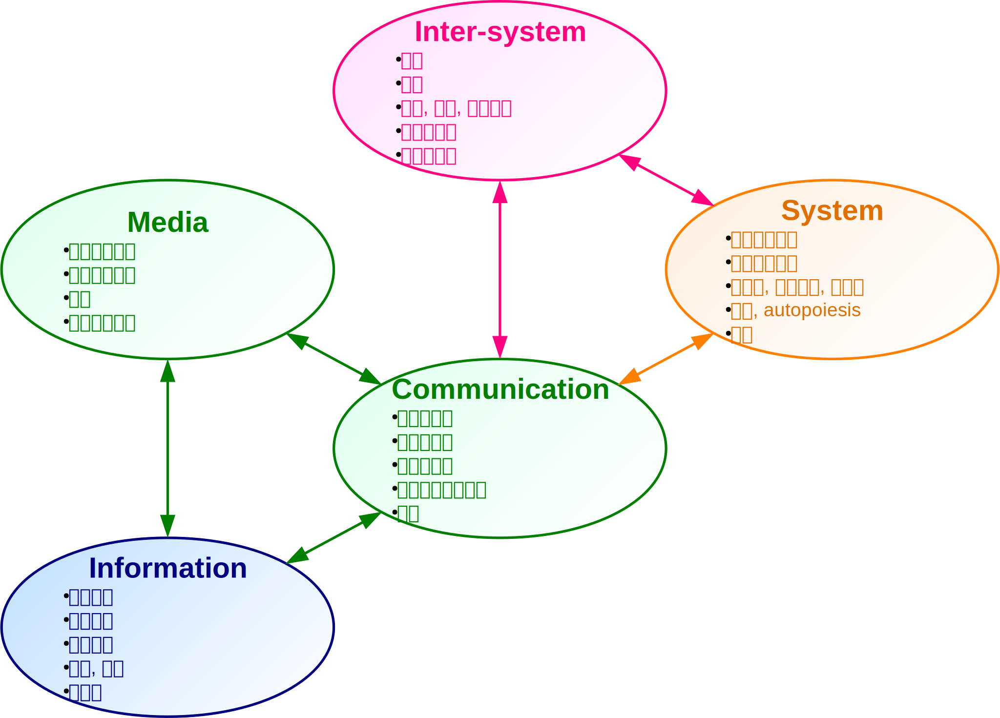

# 情報社会と情報学

## 情報学を学ぶ背景

現代社会では、インフラ、経済、行政、医療、教育など多くのシステムがコンピュータを使って構築されている。
人間は日々それらのシステムを利用して働き、学習し、他者とコミュニケーションを図るなど、コンピュータの恩恵を享受して生活している。

そうした様相を指して、現代社会を **情報社会** や **情報化社会** というようになって久しい。
現代社会の情報化を述べた最初期の著作としては、世界的にはMachlup(1962)\[[machlup]\]、日本では梅棹(1963)\[[umesao1]\]、林(1967)\[[hayashi]\]、増田(1968)\[[masuda]\]が知られている。
「情報社会」の語も林によるものとされ、日本の学界や経済界が社会における情報の役割を認識した時期は、世界的に見ても早かった。

だが、「情報」は最近になって初めて生まれたわけではない。
有史以来、人間のコミュニケーションでやりとりされていたのは常に情報であり、さまざまな新たな情報を見出し活用することで、人間の社会は発展してきた。
特に近年、コンピュータの開発に代表される技術の進展により、インターネットやSNS、スマートフォンなどで、以前にもまして多くのコミュニケーションがなされている。
その結果、コミュニケーションで生じる人間関係の問題が注目されるようになり、コミュニケーションの底層にある「情報」に多くの人が着目するようになった。
こうして情報が「発見」され、情報に対する人々の意識や関心が高まったことが、現代社会が情報社会といわれる由縁である。

## 情報学を学ぶ目的

情報社会では、すべての人々が情報について学び、誰もが情報に対する正しい認識を持ち、適切に情報を扱えるようにする必要がある。
その上で、「 *問題の発見・解決* に向けて情報と情報技術を適切かつ効果的に活用し、 **情報社会に主体的に参画** 」\[[mext]\]することが求められる。
社会の現状に対して自ら明確な問題意識を持って能動的に行動し、自らの手で社会をよりよく変化させ、社会を持続可能な形で発展させることに貢献する、これが「社会に *主体的に* 参画」するということである。

特別な経験や能力、出自などを持つ一部の人間だけではなく、誰もが情報社会に主体的に参画できるためには、情報を扱う **科学** (**science**)、即ち情報学が必要である。
日本学術会議\[[scj]\]は **情報学** (**Informatics**)を、「情報の生成・探索・表現・蓄積・管理・認識・分析・変換・伝達に関わる原理と技術を探求する学問」と定義している。
また、情報学の目的を「 *情報によって* 世界に **意味** と **秩序** をもたらすとともに **社会的価値を創造** すること」としている。
誰もが理解し活用できる、十分に客観的な知識の体系を提供するため、情報学は「 *情報と対象、情報と情報の関連を調べる* ことにより、 *情報がもたらす意味や秩序* を探求」している。

## 本稿の構成

そこで本稿では、情報学における基礎概念を示し、それらの基礎概念を基に展開される理論から得られる知見を示すことを目的とする。
本稿の前半では、生命や社会の内部における **微視的** (**micro**)な現象の理解を目的に、情報・コミュニケーション・メディアという3つの概念を示し、それらの関係性を明らかにする。
後半では、社会の変革や発展などの **巨視的** (**macro**)な現象の理解を目的に、相互に作用しあう集合であるシステムの概念を基に、システム間で生じる創発や介入といった現象を述べる。
本稿で述べる各概念の関係を図に示す。

!INCLUDE "bib.md"
