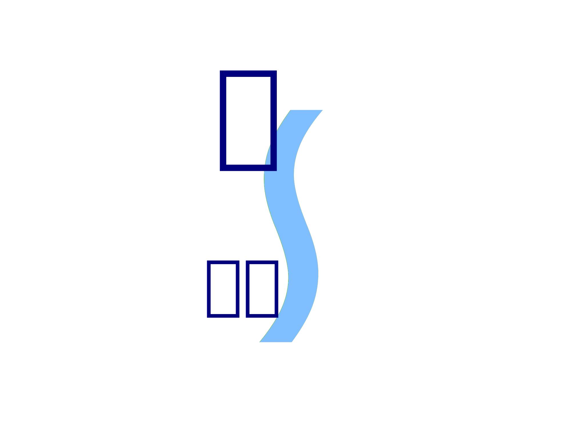
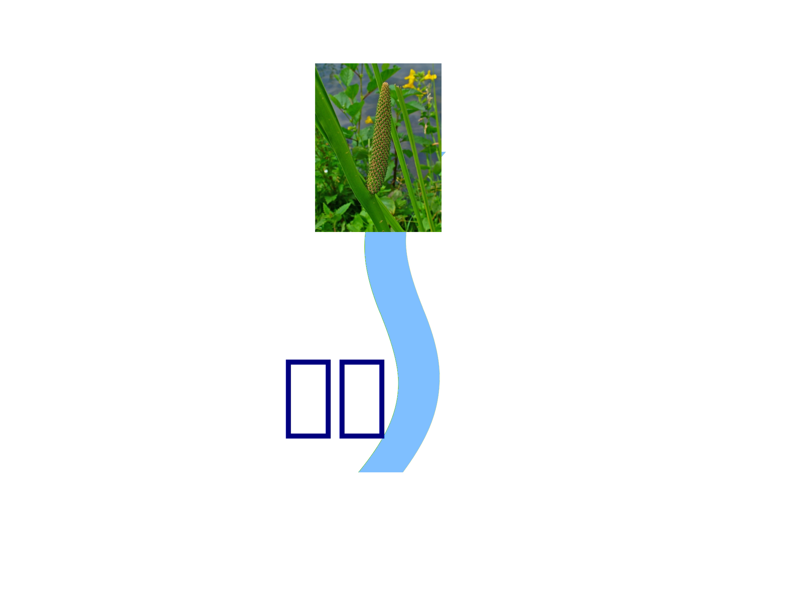

## 情報
本章では、情報の定義と性質について述べる。

まず、日本語の「情報」と英語の「information」の語源に着目し、情報と生命の関係を概説する。
次に、学術的な情報の定義とその性質を紹介し、生命がもつ主観が情報と深く関わることを述べる。
更に、情報を社会へ表出する度合いにより生命情報・社会情報・機械情報の3つに分類し、これら3つの情報概念の関係をまとめる。
最後に、社会情報と機械情報の間にある意味の潜在化と、コンピュータによる情報処理について詳述する。

### 情報の歴史
先述の通り、「情報」の存在が顕在化したのは、人類の歴史の長さから見ればつい最近のことである。
現代では、学者、企業人、教育者、政治家から一般の人々まで、様々な立場の人がいろいろな意味で「情報」の語を用いている。
例えば、花を撮影した写真を印刷したとき、印刷された「紙」を「情報」という人や、印刷された「写真」を「情報」という人がいる一方、撮影された「花」を「情報」という人もいる。
これらはすべて「情報」だとする人がいる一方で、「写真」と「花」は随分性質が異なるため、写真は「情報」だが花は「情報」ではない、という人もいる。
このように、「情報」の語が用いられるときには、人によってその意味や解釈が異なっており、その認識の違いが、「情報」に対する不明瞭さや曖昧さを引き起こしている。
各々が思い思いに「情報」を想像していると理解が深まらないため、本稿ではまず、情報に対する定義を紹介する。

小野\[[ono1]\]\[[ono2]\]\[[ono3]\]によれば、「情報」の語源は明治時代の1876年まで遡ることができる。
当時は「情報」の語を「 *情* 状の *報* 知」の省略形として用いており、「軍事作戦で自軍に対し、敵の様子を知らせること」であったという。
現在でもこうしたものを「情報」と呼ぶことがあるが、どちらかといえば、この意味は「諜報(intelligence)」の意味に近い。
「情報」が「information」の訳語に用いること自体は20世紀初頭からなされていたが、軍事的な意味以外で広く用いられるのは戦後になってからである。

### 情報の定義
このように、現在用いられる「情報」は、元々別の意味をもつ語を、informationを訳す際に当てたものに過ぎない。
そのため、日本語の「情報」の語からは、情報がもつ性質を知ることが難しい。
「情報」をより的確に捉えるには、その元となった英語の「information」と、これに対応する動詞「inform」に着目する必要がある。

英語の単語としての「inform」は、動詞「form」に接頭辞「in」が付加されたものである\[[etymology]\]。
「in」は「内側」を、「form」は「形成させる」を意味するため、informの原義は *「内側に形成させる」* ことである。
\[ \text{inform} = \text{in (内側に)} + \text{form (形成させる)} \]

通常、「inform」は「I inform you of the changes.」のように用い、ここでいう「you」など、対象を示す目的語をとる。
そのため、「in」で示される「内側」は、informの対象となる相手の内側を指す。
通常は、informの対象は人間を含む *生命* であるから、 **情報(information)** は、 *「生命の内側に『何か』を形成させる『何か』」* と定義できる。

前者の『何か』、即ち生命の内側に形成される『何か』は印象、感情、認識などであり、これらをまとめて、その生命にとってのその情報の **意味** という。
また、ある *生命にその情報が与える意味の大きさ* を、その生命にとってのその情報の **価値** という。

例えば、ある人が「菖蒲」という漢字を見て、植物のショウブを思い浮かべたなら、文字「菖蒲」は後者の『何か』に、想起された「ショウブ」は前者の『何か』、つまり「菖蒲」の意味にあたる。
また、ある人が水辺に咲く花を見て、その美しさに魅了されたなら、その「花」が後者の『何か』で、「美しい」という認識が意味にあたる。
従って、文字や花はいずれも情報だといえる。

この情報の定義では、定義中に『何か』が2回現れるが、この『何か』が何であるかには複数の見解がある。
西垣\[[nishigaki1]\]は『何か』を「パターン」であるとし、情報を *「それによって生物がパターンをつくりだすパターン」* と定義した。

また、Batesonは『何か』を「差異」、つまり2つのものの間の違いであるとし、 *「差異をつくる差異」* として情報を定義した\[[nishigaki1]\]。

なお、2つある『何か』のどちらが「情報」であるかは、議論が分かれるところである。
次節以降で述べる情報の性質を捉える場合には、生命の内部で形成された『何か』(前者、意味)の方がより本質的である。
ただ、前者を情報とすると、後者にあたる「Webページ」や「ニュース」は情報ではないとなってしまい、「情報」という語の一般的な用法と離れすぎる。
差し当たり、本稿では後者を「情報」、前者を「意味」とするが、「生命の内側に作用する」点が重要であり、どちらの『何か』を「情報」と呼ぶかは本質的な問題ではない。

### 情報の主観性
先に、「菖蒲」という文字を見たとき、人は植物のショウブを想起すると述べたが、誰もがこの文字を見て同じ認識を抱くわけではない。
「菖蒲」に当てはまる植物には、サトイモ科のショウブ(図)\[[iris1]\]とアヤメ科のアヤメ(図)の2種類があり、「菖蒲」という漢字にも「しょうぶ」と「あやめ」の2通りの読み方がある。
そのため、同じ「菖蒲」という漢字を見ても、Aさんはショウブを想起し、Bさんはアヤメを想起し、それぞれ別のものを思い浮かべるということが生じうる。

また、「菖蒲」としてアヤメ科のハナショウブ(図)を想起する人もいると考えられる。
アヤメとハナショウブは別の植物だが、ハナショウブを「あやめ」と呼ぶことも多い。
そうした認識を基に、「菖蒲」を見てハナショウブを想起した人には、ハナショウブが「菖蒲」の意味となる。

つまり、 *ある情報が何を想起させるか、つまりその情報の意味は、それを受け取る人ごとに異なっており、絶対的・客観的に決まるわけではない* 。

従って、「Aさんの内部で形成される意味」と「Bさんの内部で形成される意味」は異なる。
それぞれの *主観により意味が決定される* という点で、 **情報は主観的** なものである。
例えAさんとBさんがお互い「通じ合え」たり、「共感」したりしているように感じても、それはお互いに、相手にとっての意味が自分にとっての意味と同じだと *思い込んでいるだけ* であり、実際には両者の内部で生じた意味は異なっている。

また、ある情報が与える *価値は、客観的に計測することができない* 。
「菖蒲」という漢字は2文字と数えられるが、これはあくまで記号の数であり、その記号の価値ではない。
情報の価値は受け手により異なるため、その大きさを客観的に決定することは不可能である。
従って、情報の主観性を考慮している限り、「情報量」のような指標を定義することはできない。

### 生命情報
情報の定義に従うものには、記憶や書物、記号の羅列にしか見えない数式など、様々なものが含まれている。
これらはみな「情報」ではあるが、より細かく見ていくと、その性質により情報を分類することが可能である。
ここでは、西垣\[[nishigaki1]\]\[[nishigaki2]\]による情報の階層的な分類を紹介する。

生命は情報から意味を得て、それにより思考や行動を変化させることを繰り返して成長する。
梅棹\[[umesao2]\]によれば、そうした成長は「人間存在の根底にかかわるおそろしく基本的な活動」であるという。
情報は「生命活動の充足につながる」ものであり、ひいては生命が「生きる」ことと深く関係する。
先に情報を「生命の内側に『何か』(意味)を形成させる『何か』」と定義したが、これは *生命に何らかの意味を与えるもの* とも解釈できる。
このような生命と情報の関係を強調して、先述の情報を特に **生命情報** という。

### 社会情報
生命情報には、記憶のように生命の外に現れないものもあるが、多くの情報は書籍や音声、動画などの形で存在し、社会で流通している。
生命の内部に存在する情報が外部に表出されるには、言語や文字・記号、身振り手振りなど、他者に通じる形態をとる必要がある。
これらをまとめて記号・言語と総称したとき、 *記号・言語と意味が一体化した生命情報* を **社会情報** という。

もし社会情報が存在しなければ、人間は言語を使うことができず、絵や声、身振りなどで情報を伝えることもできないため、人間は社会を維持できなくなる。
 *社会情報の存在により、人間は互いにコミュニケーションできる* ようになり、社会を維持していくことが可能となる。

なお言語学者Saussureは、社会情報にあたるものを「記号」と呼んだ。
Saussureは、「記号」は、その意味を表す部分であるsignifié(所記)と、その表象を表す部分であるsignifiant(能記)からなり、これらは本質的に異なるという恣意性を主張した\[[saussure]\]。
本稿の「記号・言語」は、Saussureのいうsignifiantと対応する。

### 機械情報
社会情報は記号・言語と意味が一体化したものだが、その記号や言語を認識した誰もがその意味を理解できるわけではない。
例えば、「菖蒲」という漢字は社会情報だが、それを見たアメリカ人の多くは日本語を理解できないので、意味を理解できない。
同様に、英語を学ぶ機会がなければ、日本人は英語の書籍やニュース動画を理解できない。
また、次式のように複雑な記号を用いた数式も、定積分や極限などの記号の意味を学んでいれば理解できるが、記号の意味を学んだことがなければ理解できない。
\[ \int_0^1 f(x) dx = \lim_{n \to \infty} \sum_{k=1}^n \frac{1}{n} f(\frac{k}{n})  \]

このように社会情報には、そこに意味が含まれているにもかかわらず、受け手にその意味が通じないことがある。
しかし、受け手によってはその意味を理解できるから、意味が消え去ったわけではない。
むしろ、社会情報に含まれる意味が「埋もれ」、潜在化してしまったため、通じないのだというのが適切である。
意味が潜在化すると、社会情報は単なる記号の列になるため、受け手はただ機械的に複製することしかできない。
その意味で、 *意味が潜在化した社会情報* を **機械情報** という。

### 情報の階層構造
生命情報(だが社会情報でないもの)、社会情報(だが機械情報でないもの)、機械情報を比較して図示すると、それぞれ図, , のようになる。
これらの図中では、アヤメを例として、情報の意味に相当する部分を上側に、記号・言語に相当する部分を下側に表す。
また、相似記号($\sim$)で意味と記号・言語の一体性を表している。

生命情報、社会情報、機械情報には、定義から明らかなように、次の包含関係が存在する。
\[ \text{生命情報} \supset \text{社会情報} \supset \text{機械情報} \]

この包含関係を図示すると図のようになる。
一般的に「情報」というときには、「情報」がこれらのいずれを指すかを考慮することが必要になる。

### 意味の潜在化
ある社会情報が機械情報か否か、つまり、 *社会情報の意味が潜在化するか否かは、情報の受け手によって決まる* 。

例えば、漢字を読めるAさんとBさん、漢字を読めないCさんの3人がいるとする。
この3人が日本語で書かれた書籍を読むと、AさんとBさんにとってはこの書籍は機械情報ではないが、Cさんにとっては機械情報である。

他の例として、人間が機械的に経典を書き写す写経を挙げる。
写経は仏教の経典を書き写す行為であり、書き写す経典には般若心経がよく用いられる。
般若心経を書き写すだけの一般人には意味の分からない漢字の並びなので、一般人にとって般若心経は機械情報である。
写経を通じて気分が落ち着いたり集中力が高まったりしたとしても、それは単に書き写す行為の結果であり、般若心経の意味とは無関係である。
一方で、般若心経を学び理解している僧侶は、その意味を解釈して読経できるため、僧侶にとって般若心経は機械情報ではない。

コンピュータは、社会情報に含まれる意味を理解することはできない。
コンピュータが行うのは、意味が潜在化した記号・言語、つまり機械情報を複製したり、処理したりすることである。
いくら高度なアルゴリズムが使われていても、その処理は機械的な記号・言語の照合作業である。
情報の送り手の意図や、その情報に込められた意味を考えることは、コンピュータにはできない。
そのように意味を考慮せずに機械情報を扱うからこそ、コンピュータは大量のデータを高速に処理でき、ネットワークを通じて送受信できるといえる。
 *あらゆる社会情報を機械情報として扱う* のがコンピュータなどの **機械** であり、 *意味を理解できる社会情報が存在し、その理解に基づいて行動する* のが **生命** である、という表現もできる。

なお、「機械情報か否か」が受け手により異なることと、先述の「情報の主観性」は少し異なる。
例えば、先述のAさん、Bさん、Cさんの3人が漢字「菖蒲」を見たとする。
このとき、AさんとBさんはこの漢字を読み、Aさんはショウブ(図)を、Bさんはアヤメ(図)を思い浮かべたとする。
Cさんは漢字を読めないので、字面以上の何も思い浮かべることはできない(図)。
このとき、「菖蒲」はCさんには機械情報だが、AさんとBさんにとっては機械情報でないというのが、「機械情報か否か」が受け手により異なるということである。
一方で、AさんとBさんにとって「菖蒲」の意味が異なることが、「情報の主観性」である。

