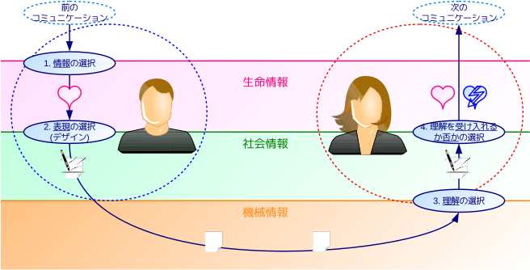

## コミュニケーション
本章では、コミュニケーションがどのような過程を経てなされるかを概説する。

まず、社会学におけるコミュニケーション・モデルの一つである、Luhmann\[[luhmann]\]のコミュニケーション・モデルを概観する。
その上で、このモデルを構成する4つの選択である、情報の選択・表現の選択・理解の選択・理解の受容の選択について詳述する。
また、コミュニケーションのそれぞれの段階と、先述の生命情報・社会情報・機械情報の関係性についても述べる。

### コミュニケーション・モデル
コミュニケーションは二者間の相互の関係としてみなされることが多いことから、コミュニケーションがどのようなものかについて、簡潔な定義を用いて説明されることは少ない。
むしろ、コミュニケーションがどのような過程から構成されるか、という抽象的なモデルを用いて説明されることが多い。

コミュニケーションに関するモデルには、Luhmann\[[luhmann]\]やChen\[[chen]\]のものが挙げられる。
Luhmannは、コミュニケーションを4つの選択からなる過程とした。
またChenは、コミュニケーションを表現(expression)と摂取(impression)からなる過程だとした。
この「摂取」はimpressionの訳語だが、日本語としては「銘記」に近い。

これらはいずれも、いくつかの段階をコミュニケーションの単位として、その反復によりコミュニケーションが継続する、という点で共通している。
本稿では、Luhmannによるコミュニケーションのモデルを紹介する。

Luhmannは、 **コミュニケーション** は二者間でなされる *4つの選択からなる過程* であり、その反復によりコミュニケーションが継続するとした\[[borch]\]。
4つの選択は下記の通りであり、3つの選択と、それに続く1つの選択からなる。

-  **情報** の選択
-  **表現** の選択
-  **理解** の選択
-  **理解の受容** の選択
このモデルは、先述の西垣による3つの情報概念と図のように対応する。
図では、コミュニケーションの過程を矢印で、Luhmannのコミュニケーション・モデルにおける選択を実線の楕円で表している。
また、左右の点線の楕円はそれぞれ、情報の送り手と受け手が行う行為の範囲を表している。

### 情報の選択
まず、送り手と受け手でやりとりされる **情報** が選択される。
この選択は、コミュニケーションが始まる際に送り手が話題を探して選ぶこともあれば、それまでの会話の「流れ」や場の「空気」などの文脈から半ば自動的に選ばれることもある。

ここでいう「情報」はまだ言語を伴っていないため、西垣の定義でいう生命情報にあたる。

### 表現の選択
情報の選択に続き、選ばれた情報をどう伝えるかという **表現** が送り手により選択される。
ここでどのような表現が選択されるかには、「なぜその情報を伝えたいか」という送り手の **意図** が関わる。
こうして、情報に対して意図が反映されることで、どんな形や方法で表現するかが決定される。
この関係を等式で表すと次のようになり、表現の選択は、この等式の左辺から右辺への変換であるといえる。
\[ (\text{情報}) + (\text{意図}) = (\text{表現}) \]

表現の選択は、 *生命情報に記号・言語が付与される* ことに相当する。
表現の選択により、情報の選択で選ばれた生命情報は、記号・言語と意味が一体化した社会情報となる。

このように表現を選択することを、一般に **デザイン(design)** ともいう。
次に述べるように、表現をどう受け取るかは受け手の主観しだいであり、送り手の意図や伝えたい情報が正しく伝わる保証は何もない。
そのため、送り手が正しく自らの意図を伝えようとするには、可能な限り受け手の反応を想定し、理解しやすい形で伝えることが必要である。

なおLuhmann\[[luhmann]\]は、どのように伝達するかが選択されるという意味で、この選択を「伝達(utterance)の選択」と表現している。

### 理解の選択
表現の選択に続き、その表現をどのように **理解** するかが受け手により選択される。
このとき情報の主観性により、受け手が *どう理解するかは、完全に受け手の主観* により決まる。
そのため、送り手の選択された情報がそのまま伝わるわけではなく、いわゆる「誤解」のように、送り手の想定しない理解がなされることもある。

正しい理解とは何かについて、単に情報が伝われば良いのではないとLuhmannは述べている。
Luhmannは、表現の選択で送り手の意図が表現に反映されることから、 *表現から情報と送り手の意図を正しく区別* できることが必要だという。
つまり、送り手が表現の選択の際に用いた下記の等式を、逆向きに用いるのが理解の選択である。
\[ (\text{情報}) + (\text{意図}) = (\text{表現}) \]

この等式を送り手とは逆向きに用い、受け手が正しく左辺から右辺に変換することが、「正しい」理解だという。
もっとも、情報の主観性により、そのような「正しい」理解がなされる可能性は殆どない。

単に情報を受け取るだけでは、送り手がなぜその情報を伝えたのか、またなぜその表現を選んだのかを受け手は理解していない。
これでは受け手は、なぜその情報が重要なのかも分からずただ情報を受け取るだけになってしまい、コミュニケーションとしては不十分である。
従って、送り手の意図まで含めて理解することが重要である。

送り手が社会情報として送り出した情報も、受け手にとっては最初は機械情報にすぎない。
理解の選択を通じて、受け手は *機械情報の潜在化した意味を主観的に拾い出して社会情報に* 変化させる。
繰り返すが、受け手が意味を見出すのはあくまで主観的な行為なので、受け手の理解が送り手の想定と同じになることはほぼありえない。

### 理解の受容の選択
理解の選択が終わると、その理解を受け入れるか否か、という **理解の受容** が受け手により選択される。
送り手の意図を受け手がある程度推測できたとしても、その意図を受け入れるかどうかは受け手の自由である。
このように「知っていても知らないふりをして」とぼけたり耳を塞いだりすることは、日々のコミュニケーションで多々ある。

理解を受け入れるか否かを選ぶことで、受け手は *社会情報を生命情報として取り込むか、取り込まないか* を決定する。
受け入れるのであれば、受け手は次のコミュニケーションにおける情報の選択として、好意的な返答を返すことになる。
受け入れないのであれば、受け手は次のコミュニケーションで否定的な返答をしたり、そもそも無視して返答しなかったりする。

受け手が何らかの返答を返すならコミュニケーションは継続し、送り手と受け手が入れ替わって次の情報の選択がなされる。
Luhmannはこれら4つの選択を1つのコミュニケーションの単位として、これが反復され継続していくのが円滑なコミュニケーションであるとした。

!INCLUDE "bib.md"
