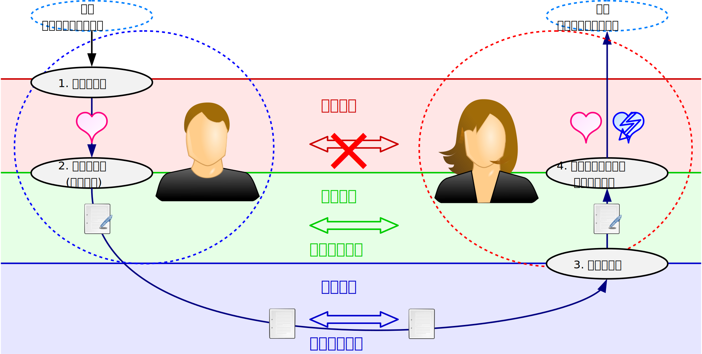

# メディア

本章では、メディアの定義と性質について述べる。

まず、前章のコミュニケーション・モデルでメディアが果たす役割について述べる。
次に、メディアの語源を辿りながら、メディアの定義を示す。
更に、Luhmannによるメディアの分類に基づいて、伝播メディアと成果メディアという2つのメディアを紹介する。
また、生命情報を媒介するメディアの存在について考察する。
その上で、メディアが個人に与える影響や、メディア・リテラシーとコミュニケーション能力の関係を述べる。

## メディアとコミュニケーション

Luhmannのコミュニケーション・モデルに従うコミュニケーションを行おうとすると、表現の選択と理解の選択の間に断絶があることが分かる。
情報の送り手による表現の選択の後、すぐに情報の受け手が理解の選択を行うことになる。
そのため、送り手は表現を「選んだ」だけで、実際には何も表現されていない。
どれだけ表現を工夫したとしても、考えただけで実際に表現しないのであれば、どう頑張っても受け手には伝わらない。

コミュニケーションの際にまず意識すべきことは、 **相手に自分の伝えたいことが伝わることはありそうにない** ということである\[[borch]\]。
具体的な「ありそうにない(unlikely)」こととしては、次の2つが挙げられる。

-  **その場にいない相手とコミュニケーションができる** ことは *ありそうにない* ことである。
		遠く離れた場所にいる相手や、過去や未来にいる相手など、時間的・空間的に離れた相手とコミュニケーションすることは、本来ありえないことである。
-  **相手に自分の主張が受け入れられる** ことは *ありそうにない* ことである。
		相手に自分の主張が伝わったとしても、自分と相手は別の人間であるので、相手が自分に理解を示してくれることは、本来ありえないことである。
従ってコミュニケーションは、本来「ありそうにない」ことが起こっているため、きわめて奇跡的な事象である。
このように「ありそうにない」ことが起き、実際にコミュニケーションが成り立つためには、情報の送り手と受け手の *間* に、何らかのものが入っている必要がある。
一般的に **メディア** (**media**)と呼ばれるのは、このように *情報の送り手と受け手の間に入るもの* である。

## メディアの定義

メディアは元々、「中間」を意味する語「medium」の複数形であり、「2つのものの *間に入る* もの」を意味する。
情報学でのメディアはマスメディアだけでなく、複数人がコミュニケーションする際に、情報を伝える手段として使われるものである。
そしてメディアの存在により、時間的・空間的に離れた相手ともコミュニケーションを行うことが可能になる。
従って、 **メディア** は *コミュニケーションにおいて情報を媒介するもの* である。

メディアというと書籍や放送、音楽などが想起されるが、より一般的なメディアも考えうる。
Luhmannは、メディアを「起こりそうにないコミュニケーションを起こりそうなコミュニケーションに変換することに関与するメカニズム」だという\[[borch]\]。
これをより簡潔に言えば、「コミュニケーションを秩序づけるもの」がメディアである。

## メディアの分類

Luhmannは、メディアを伝播メディアと成果メディアに分類した\[[borch]\]。
機械情報を物理的に媒介するのが伝播メディア、社会情報を論理的に媒介するのが成果メディアであり、これらの存在により、先述の「ありそうにない」ことが「ありうる」ことになる。
図にメディアを両端付きの矢印で追記すると、コミュニケーション・モデルと図のように対応する。

## 伝播メディア

新聞や放送は、文章や番組を機械情報として、紙や電波という物理的な物質を使って伝播することで、時間的・空間的に離れた相手とのコミュニケーションを可能にする。
このように、 *機械情報を物理的に媒介* するメディアを **伝播メディア** という。

TVや新聞、雑誌などのいわゆるマスメディアや、書籍やCD、インターネット、電話、SNS、また音や空気なども、機械情報を伝播する点では同様であり、伝播メディアである。
一般的に「メディア」と呼ばれるほぼすべてが、伝播メディアにあたる。

## 成果メディア

一方の **成果メディア** は、情報の送り手と受け手の間で *社会情報を論理的に媒介* するメディアである。
成果メディアの「成果」は、 *その存在によってコミュニケーションの成果が上がり、コミュニケーションが円滑に進む* ことで、相手が自分の要請を受け入れやすくなるということを表している\[[usui]\]。

最も基本的な成果メディアには、特定の組織でのみ通用する *「内輪ネタ」* や *「暗黙のルール」* 、 *「常識」* 、 *組織文化* 、 *伝統* などがある。
これらは、その存在によって組織内のコミュニケーションを円滑に進められるので、成果メディアである。

人間の社会をより大きい「組織」とみなしたとき、人間社会で存在する成果メディアとして、Luhmannは *真理* 、 *愛* 、 *貨幣* 、 *法* 、 *権力* 、 *宗教* 、 *芸術* を例示している。
これらは、人間社会でのコミュニケーションを円滑に進められるものであり、組織文化などと同様に成果メディアだといえる。

成果メディアがメディアである説明として、法について述べる。
交差点に歩行者と車の運転手がいて、停止中の車の前を歩行者が横断したいとする。
ここで、歩行者側が青信号、車側が赤信号であれば、歩行者は安全に道路を渡ることができる。
このとき歩行者と運転手の間に、道路交通法を媒介とするコミュニケーションが成立する。
運転手は道交法に基づき、赤信号を遵守して、信号が変わるまで発進しない。
歩行者も道交法に基づき、運転手が赤信号を遵守し、信号が変わるまで発進しないだろうと予期する。
道交法を媒介とした結果、歩行者は安全に道路を渡れるため、法はコミュニケーションを秩序づけているといえる。

また、コミュニケーションにおける最初の状態と最後の状態が同じでも、どの成果メディアが作用するかにより、コミュニケーションの内容は異なったものとなる。

> #### info::作用する成果メディアの違い
>
> 例として、災害後に瓦礫の下敷きになって動けない人がいる横を、誰かが通りがかった場合を考える。
このとき、下敷きの人の存在に気づけば、たとえその人が助けを求めていなくても、多くの人はその人を助けようとするだろう。
「瓦礫の下敷きになっている人がいる」という最初の状態に対しては、大抵の場合、「下敷きの人を助ける」という最後の状態がくると考えられる。
>
> しかし、他人をなぜそのように助けるかという理由には、次のように様々なものが考えられる。
- 「下敷きの人も自分と同じ人間だ(から助ける)」という「 *愛* 」
- 「下敷きの人を放置すれば死ぬ(から助ける)」という「 *真理* 」
- 通りがかりの人がレスキュー隊の隊員であれば、救助作業によって「 *貨幣* 」を報酬として得るので、「お金を得るための仕事だ(から助ける)」
- 保護責任者遺棄致死罪などの「 *法* 」の存在により、「助けなければ罰せられる(から助ける)」
- 町長や自治会長が「負傷者を見つけたら救助するように」と住民に指示しており、その「 *権力* 」に従い、「長の命令に従う(から助ける)」
- 「困っている人を助けること」を教義とする「 *宗教* 」を信奉しており、「教義に従う(から助ける)」

>
> 通りがかりの人と下敷きの人の間にこうした成果メディアが存在し、そのいずれかが両者を媒介することで、コミュニケーションが成立して円滑に進む。
これらの成果メディアが存在しない場合は、自分にとって利益をもたらさない可能性が高い「見知らぬ他人を救助する」という行為は生じにくい。

## 生命情報を媒介するメディア

成果メディアは、図で伝播メディアの上に記したように、伝播メディアが物理的に媒介した機械情報を基に、送り手と受け手の間でより抽象的に媒介するメディアである。
そのため、機械情報を媒介する伝播メディアが存在しない場合には、成果メディアのレベルでのコミュニケーションも成り立たない。

同様にして、成果メディアが媒介した社会情報を基に、生命情報のレベルでコミュニケーションを媒介するメディアも想定できる。
もしそうしたメディアが存在すれば、回りくどく社会情報や機械情報を経由せずとも、送り手から受け手へ思考を伝え合える。

生命情報を媒介するメディアがあるとすれば、まさしく *テレパシー* (*telepathy*)である。
テレパシーが存在するかや実現できるかは、学術研究からオカルトに至るまで様々な言説があり、議論の余地がある。
しかし、少なくとも現時点では、多くの人間がテレパシーを自由に利用できる段階に到達していないことは確かである。
従って、遠回りにはなるが、社会情報や機械情報という形を経由して情報を伝えることが必要になる。

## メディアが個人に与える影響

我々はメディアを媒介としてコミュニケーションを図り、メディアを通じて情報を得る。
そのため、メディアは我々が直面している世界の現実がどのようであるか、という認識の形成に寄与している。
この、 *現実がどのようであるかについて個人がもつ認識* を **現実イメージ** という\[[nishigaki1]\]。

コミュニケーションを通して伝えられる情報は不完全であり、また情報は主観的なものである以上、 **現実イメージと現実は異なっている** 。
\[ (\text{現実イメージ}) \neq (\text{現実}) \]

人間はしばしば、自分が見聴きした情報を正しいものと信じる傾向にある。
つまり、自らがもつ現実イメージが実際の現実そのものだと信じやすい。
そのため、現実イメージと現実の違いには常に留意する必要がある。

## メディア・リテラシーとコミュニケーション能力

いわゆる **メディア・リテラシー** は、 *メディアを「読み書き」する能力* と定義される\[[nakahashi]\]。
この *リテラシー* (*literacy*)は、「読み書きそろばん」のように、小学校で習う程度の基本的な技能のことを意味している。
メディア・リテラシーは、文字の読み書きのようにメディアを「読み書き」する能力として、比喩的に表現されたものである。

「読み書き」する能力ということから明らかなように、メディア・リテラシーは、 *情報の受け手としてメディアを批判的に「読む」能力* と、 *情報の送り手としてメディアを活用して「書く」能力* からなる。
\[ (\text{メディア・リテラシー}) = (\text{メディアを「読む」能力}) + (\text{メディアを「書く」能力}) \]

Luhmannのコミュニケーション・モデルからみれば、「読む」能力は情報の選択と表現の選択に対応する能力で、図の右側にある点線の楕円にあたる。
また、「書く」能力は理解と理解の受容の選択に対応する能力で、図の左側にある点線の楕円にあたる。
従って、これらの能力はそれぞれ、コミュニケーションの受け手と送り手としての能力に対応する。

	(\text{メディアを「読む」能力}) = (\text{コミュニケーションの受け手としての能力}) \\
	(\text{メディアを「書く」能力}) = (\text{コミュニケーションの送り手としての能力}) \\

コミュニケーションの送り手や受け手としての能力を **コミュニケーション能力** と呼ぶと、コミュニケーション・モデルはこれら4つの選択から構成されるので、 *メディア・リテラシーとコミュニケーション能力は同じ能力* といえる。
「メディア・リテラシー」と呼ぶか「コミュニケーション能力」と呼ぶかは、送り手と受け手の間に入るメディアに着目するか、送り手と受け手という人間に着目するかという着目点の違いである。
\[ (\text{メディア・リテラシー}) = (\text{コミュニケーション能力}) \]

4つの選択のうち、情報の選択と表現の選択は情報の送り手に、理解の選択と理解の受容の選択は情報の受け手に委ねられている。
情報を送り手がどう表現したかと、それを受け手がどう理解したかに、コミュニケーションの成否は大きく依存する。
従って、送り手が意図した通りのコミュニケーションができる保証は全くない。
コミュニケーションの際にこれを意識しておかなければ、言葉足らずな表現になったり、勘違いが起きたりして誤解を生むことになる。
そうした誤りが起きないよう、メディアから個人に与えられる現実イメージが正しいものかを批判的に捉えることや、誤った現実イメージを与えないよう表現を工夫することが必要になる。

!INCLUDE "bib.md"
