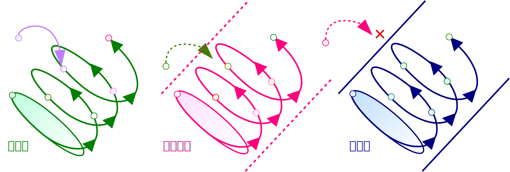

## システム
本章では、前章までの情報・コミュニケーション・メディアを基に成立するシステムについて述べる。

まず、システムの概念とその例を提示し、生命とその活動によって生じるさまざまな構成体が、システムという統一的な視点で俯瞰できることを述べる。
その上で、システムの重要な特徴であるオートポイエーシスについて述べる。

### システム
Bertalanffy\[[bertalanffy]\]によれば、 **システム** (system, 系)とは *相互に作用しあう要素の集合* である。
要素からなるのは通常の集合と同じだが、その *要素が互いに関連* していることが、システムの最大の特徴である。
この *要素間の関連性* を、そのシステムにおける **構造** (structure)という。

例えば学級は、一定数の生徒と担任を要素とするシステムである。
それぞれの要素である生徒はバラバラに動くのではなく、他の生徒や担任の言動に影響を受けて行動している。
同様に、学校も生徒と教職員からなるシステムである。
社員からなる企業、学生からなる学生団体などの組織もシステムの一種であり、国や自治体はある地域の居住者からなるシステムである。
法律も個々が単体で存在するわけではなく、憲法や他の法律に影響されて存在しているため、憲法や法律、条例からなる法体系もシステムである。
経済における市場も、そこでやりとりされる商品の利害関係者からなるシステムであり、株式市場で日々行われる売買は、他の投資家の動向に左右される。

システムは構造をもつ、つまりシステムにおける要素は相互に関連するため、これを *個々の要素に分解して分析すると、システムの性質を正しく把握できない* 。
例えば野球やサッカーなど集団競技のスポーツでは、個人のプレーは当然重要ではあるが、個人を寄せ集めただけでは試合を行うことができない。
一定の人数でチームを作り、その連携によって初めて可能になるプレーもあり、そうした連携の積み重ねにより、チーム全体の能力は各個人の能力の和よりもずっと大きくなる。
逆に、チームでお互いの足を引っ張り合えば、そのチームの能力は個人の能力の和より小さくなってしまう。

従って、システムの能力を$S$、そのシステムに属する$n$個の要素の能力を$s_1, \cdots, s_n$と表すと、$S \neq \sum_{i=1}^n s_i$となる。
なお$\sum_{i=1}^n s_i$は$s_1, \cdots, s_n$の総和で、$\sum_{i=1}^n s_i = s_1 + s_2 + \cdots + s_n$と定義される。
このように、 *システム全体の能力が各要素の能力の和と等しくならない* 性質を、システムが **構成的** であるという。
一方、通常の集合では、集合を個々の要素に分解したとき$S = \sum_{i=1}^n s_i$となるので、集合は **総和的** であるという。

### システムの閉鎖性
円という点の集合が円周を境界に持つように、システムもまた **境界** をもつ。
例えば、学級という組織はその学級に所属している生徒からなるシステムであり、他学級の生徒はその外部にある。
このように、あるシステムの *境界の外部* を、そのシステムの **環境** という。

システムは、その境界の外側、つまり環境から影響されるかどうかにより、開放系、半閉鎖系、閉鎖系に分類が可能である。
ガラパゴス諸島の生態系のように、 *環境の影響を受けないシステム* を **閉鎖系** (closed system)という。
一方、入力に従って処理を行う情報システムのように、 *環境の影響を受けるシステム* を **開放系** (open system)という。

開放系は更に、 *間接的に* 環境から影響を受けるが、環境から直接影響を及ぼすことができない **半閉鎖系** (semi-closed system)と、直接的に環境から影響を受ける通常の開放系に分類できる。
半閉鎖系は、システムの *内部から外部を観察し、外部の変化に反応* することで、間接的に環境の影響を受ける。
内部からの観察や反応がなければ、外部からどれだけ強い刺激を与えても、半閉鎖系のシステムに影響を及ぼすことはできない。
また内部から反応がありシステムが変化した場合も、その反応が外部から与えた刺激の通りのものになるとは限らない。

図に、システムを閉鎖性により分類して示した。
図ではシステムを円で、システムの境界を演習で表している。
外部の影響を受ける開放系は点線で、外部の影響を受けない閉鎖系は実線とした。
また、システムが時間の経過と共に変化することを、境界に三角を付して表した。

### システムの状態
閉鎖系であれ開放系であれ、時間が経つにつれ、システムの構造は変化する。

ある *時刻$t$におけるシステム$S$の構造* を、$S$の時刻$t$における **状態** と呼ぶ。
特に最初の時刻、即ち時刻0におけるシステムの状態を **初期状態** という。
またシステムの状態が一定になり、もはや変化しなくなったとき、その状態を **定常状態** という。

システム内のある要素を元にしてシステムの要素が新たに生み出されたり、要素の間に新たな関連が生まれたりする。
そうして構造が変化すると、その輪郭であるシステムの境界もまた変化する。
このようにして、 *システムが自律的に作動し、自身で変化* していく性質を **オートポイエーシス** という\[[kawamoto]\]。

図に、閉鎖性によるオートポイエーシスの違いを示す。
外部の影響を受ける開放系では、外部の変化によりシステムの状態が変化し、次の状態が決まる。
半閉鎖系では、外部が変化しても直接影響を受けることはないが、システム内部から外部の変化を観察することで外部の影響を受け、次の状態が変化することがありうる。
閉鎖系は外部から影響を受けないため、外部で生じた変化の影響を受けてシステム内部の状態が変化することはない。

### システムの例
システムの例には生態系や生物の循環系、化学における反応系などがあるが、ここでは主に社会的なシステムに焦点を当て、心理システムと社会システムを例示する。
これらは人間の社会を構成する基本的なシステムであり、いずれも半閉鎖系であることが特徴である。

#### 心理システム
 **心理システム** は *思考* を要素とするシステムである\[[kawamoto]\]。
Descartesが「我思う、ゆえに我あり」と述べたように\[[descartes]\]、心理システムは生命の *意識* ともいえる。

 **思考** は、 *送り手と受け手が同一であるコミュニケーション* である。
人間の思考では、思考が「ひとりごと」として外在化するか否かにかかわらず、記号・言語が用いられる( **シンボル機能** )\[[bertalanffy]\]。
特に母語である言語は人間の思考様式に大きな影響を及ぼしており、 *母語が異なれば思考様式が異なりうる* 。
これは、人間の思考様式が普遍的に同じであることを否定するものであり、 **言語相対仮説** や **Sapir-Whorf仮説** と呼ばれる\[[deutscher]\]\[[imai]\]。

心理システムは知的な生命を構成する最も基本的なシステムである。
連続的な思考の積み重ねは思考間の関連を生み出し、心理システムの構造を形成する。
こうして形成された構造がそのシステムにとっての *世界* であり、そのシステムが持つ *現実イメージ* である。
この「世界」や「現実イメージ」が実際の現実と異なっていることは、前述の通りである。

心理システムの思考は、誤りが生じぬよう、論理的で合理的であることを志向して展開される。
だが、現実イメージは現実の一部分を捉えたものでしかなく、しかも実際の現実とも異なっている。
そのため、心理システムにおける思考は、決して完璧に正しいとはいえず、最適な判断ができるわけでもない。
心理システムがもつ、 *ある限定された範囲までの合理性しかない* 性質を **限定合理性** という\[[simon]\]。

心理システムを構成する思考には、システムの外部から直接に影響を与えることはできない。
システムの外部、即ち環境が人間の思考に影響を与えられるのは、ただ人間が環境を観察し、それに反応したときのみである。
例えば、ある人間にどれほど強い肉体的攻撃を加えても、攻撃に屈しない限り、その人間の思考を束縛することは不可能である。
この意味で、 *心理システムは半閉鎖系* であるといえる。

#### 社会システム
心理システムがもつ限定合理性を克服するため、生命は他の生命と合同し、より大きな集団を形成する。
その集団内でコミュニケーションを行ってお互いの限定合理性を補い合い、より完全な合理性を手に入れようとする\[[kuwata]\]。
このようにして形成される **社会システム** は *コミュニケーション* を要素とするシステムであり、 **組織** とも呼ばれる\[[barnard]\]\[[simon]\]。
生命が互いに連携して社会を構成するためには、社会システムの存在が不可欠である。

社会システムは、そこに形式上所属する人間ではなく、そこで行われるコミュニケーションが要素となる\[[borch]\]。
つまり、例えばある学級に形式上は所属していても、そこで行われるコミュニケーションに一切参加しなければ、社会システムとしての学級に関与しているといえない。
逆に、その学級に所属していなくとも、そこでのコミュニケーションに参加していれば、社会システムとしての学級に関与しているといえる。

社会システムには、その要素である *コミュニケーションを支える、固有の成果メディアが存在* する。
特定の企業などの場合、この成果メディアは **組織文化** (corporate culture)と呼ばれ、組織のコミュニケーションを円滑にする。
組織文化が通用する範囲が組織の内側であり、組織文化が通用しなくなる外側との間に境界が発生し、組織の一体感が生じる源泉ともなる。

前述した、より一般的な成果メディアに対しても、それぞれが通用する社会システムが存在する。
例えば、 *真理* は学会や学術システムが、 *愛* は家族や血縁に基づくシステムが、 *貨幣* は市場などの経済システムが、 *法* は裁判所や司法システムが、 *権力* は自治体や官庁などの政治システムが、 *宗教* には教団が、 *芸術* にはパトロンやファン組織が対応する。

社会システムは個々の心理システムが複合して存在しているため、心理システムがもつ特徴を継承している。
まず、元となる心理システムが限定合理性をもつ以上、それらのコミュニケーションから構成される社会システムがもつ合理性もまた、限定的である。
システムが構成的であるため、コミュニケーションの結果として元の心理システムがもつ合理性の範囲よりは広い合理性をもつとはいえ、依然として *社会システムは限定合理性をもつ* 。

また、心理システムの思考と同様に、社会システムのコミュニケーションも、外部から影響を与えることは難しい。
例え企業が倒産したり、国がなくなったとしても、それらに関するコミュニケーションには直接、影響を及ぼすことができない。
従って、 *社会システムは半閉鎖系* である。

!INCLUDE "bib.md"
