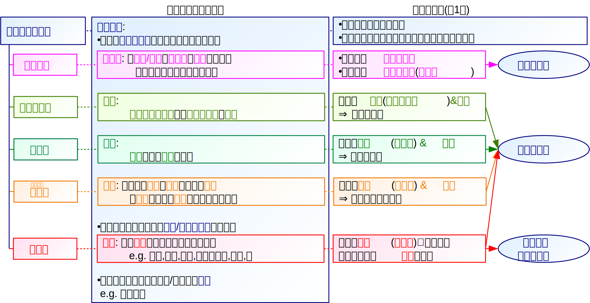
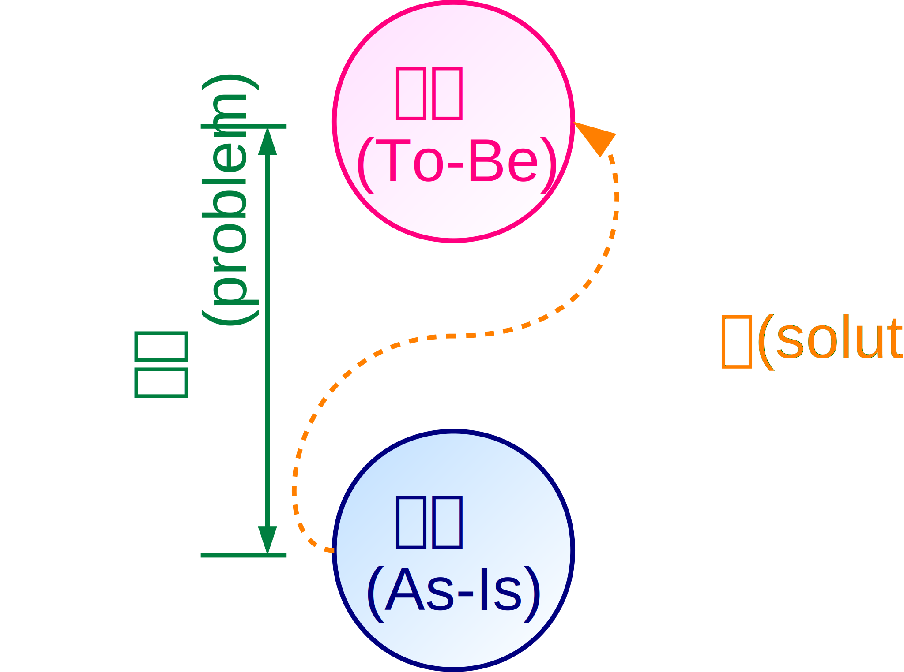

# 創発

本章では、前章で述べたシステムの創発性に注目し、社会で新たな情報が生まれる過程を述べる。

まず、新たな情報を生みだす方法として、組み合わせとその関連性を見出す重要性を述べる。
次に、心理システムと社会システムによる創発のそれぞれについて、Luhmannが定義した個性と人格の概念を使って述べる。
続けて、創発を促す発想法や思考法について、より具体的に述べる。
また、代表的な創発過程である問題解決と、問題解決で使われるモデルについて述べる。
更に、創発主義と還元主義の関係を述べ、創発の概念が果たす理論的な役割を述べる。
最後に、機能的分化の結果として生じる社会的排除が社会システムによる創発に及ぼす影響を考察する。

## アイデアとイノベーション

システムの創発性に基づいて、 *あるシステムで新たな情報が生まれる現象* を、そのシステムにおける **創発** (**emergence**)と呼ぶ。
また、 *創発の結果として生じた新たな情報* を **アイデア** (**idea**)という。

Youngはアイデアを、 **既存の要素の新たな組み合わせ** だと述べている\[[young]\]\[[young-j]\]。
あらゆる発想は全く何もないところから湧き出すのではなく、意識的であれ無意識的であれ、既知のものを組み合わせて生まれる。

そうした発想を生み出すには、組み合わせる元になる「既存の要素」について、現状でどのようなものが存在し、何が実現されていないのかといった、相応の知識が必要となる。
特に、複数の「既存の要素」を組み合わせることから、複数の分野についての専門的な知識が必要である。

更に、既知の要素から意味のある組み合わせを生み出すには、 *物事の関連性(構造)を見つけ出す* ことが必要である\[[young]\]\[[young-j]\]。
物事の表層の類似性に囚われず、その深層にある繋がりを洗い出すことで、強引なこじつけではなく、新鮮で自然な関連性を見出せる。
そうして見出された関連性こそが新たな情報であり、新たなアイデアである。

アイデアは、それまで存在しなかった、人間にとって意味のある新たな情報であり、創発により社会が発展するといえる。
Schumpeterは、このように新たな組み合わせを生じさせることを **イノベーション** (**innovation**)と呼び、社会発展の源泉だとした\[[schumpeter]\]。

> #### info::創造システム
>
> 井庭は、個人や組織における創発の過程を表す枠組みとして、 **創造システム** の理論を提唱している\[[iba]\]\[[iba-j]\]。
井庭によれば、創造は *発見* (*discovery*)を要素とするシステムである。
発見は *アイデア* 、 *関連づけ* (*association*)、 *帰結* (*consequence*)の3つの選択からなる過程であり、発見が継続して生成されることで創造がなされるという。
ここでいうアイデアは、創造を行うシステムにとっての新たな情報であり、世間的に新しいものであるかは問われない。
このアイデアをどう他の情報と関連付けるか、つまりどう相互の関連性を見出すかが重要であることは、上述のYoungの主張と同様である。

## 心理システムによる創発

システムが要素間の新たな関連性を見出すには、そのシステムがそれらの要素に参画しており、それぞれの要素に精通していることが必要である。
ある *システムが所属する他のシステムの部分を除いた、そのシステムに固有の部分* を、そのシステムの **個性** (**personality**)と呼ぶ\[[borch]\]。

例えば、あるシステムが他のシステムと図の関係にあるとする。
このとき、図中で他のシステムに属する部分を除いた、桃色の部分が個性である。

個人による、つまり1つの *心理システムによる創発* では、心理システムの個性が特徴的であることが必要である。
ここでいう特徴的とは、所属する *他のシステムの組み合わせが他にない珍しいもの* である、ということを指す。
この組み合わせがよくあるものである場合には、心理システムが思考を重ねても、誰でも思い浮かぶ発想しか現れない。
一方、特徴的な個性をもつ場合には、心理システムの思考は他にないものになり、新たなアイデアが生じる可能性が高い。

## 社会システムによる創発

個人には限定合理性があるため、1つの心理システムによる創発にも限界がある。
そのため実際には、複数人が協働し、 *社会システムによる創発* を行うことが多い。
社会システムによる創発では、複数の心理システムの個性を掛けあわせて、コミュニケーションを通じて個人の限定合理性を克服することが期待される。

社会システムによる創発においても、新たなアイデアを生み出すには、 *社会システムの個性が特徴的* であることが必要である。
社会システムの個性が特徴的であるためにはまず、心理システムの場合と同様に、社会システムが所属する他の心理システムの組み合わせが珍しいものである必要がある。
例えば、チームの人選を行う際には、似た個性を持つメンバーではなく、できるだけ個性の異なるメンバーを集める必要がある。

社会システムはコミュニケーションを要素とするため、コミュニケーションなしには社会システムによる創発はなしえない。
コミュニケーションが新たなアイデアを生み出すには、それぞれの心理システムの個性が反映されたコミュニケーションが必要である。
いくら個々のメンバーが特徴的な個性を持っていても、そうした個性を持つことが他のメンバーとのコミュニケーションの俎上に登らなければ、社会システムによる創発には貢献しない。
このように、 *ある心理システムを他の心理システムがコミュニケーションでどう扱うか* を、そのシステムの **人格** (**character**)という\[[borch]\]。
従って社会システムによる創発では、個々のメンバーがどのような個性を持つ人間であるかをチーム内で共有させることが必要である。
個々のメンバーの *個性を人格として顕在化し、メンバーの個性をチームの個性として取り込む* ことで、それを組み合わせた新たなアイデアが生じる。

> #### info::知的財産
>
> 知的財産法は、創発の促進を目的に存在する法的な枠組みの総称であり、その概略を図に示す。
現代における知的財産法の枠組みでは、基本法としての知的財産基本法\[[law-ip]\]があり、その下に特許法\[[law-patent]\]、実用新案法、意匠法、商標法、著作権法\[[law-copyright]\]などの個別法が置かれている。
>
> 知的財産基本法では、その目的を「新たな知的財産の創造及びその効果的な活用による付加価値の創出」としている。
また特許法は「発明の保護及び利用を図ることにより、発明を奨励し、もつて *産業の発達* に寄与すること」、著作権法は「著作者の権利及びこれに隣接する権利を定め、これらの文化的所産の *公正な利用* に留意しつつ、 *著作者等の権利の保護* を図り、もつて *文化の発展* に寄与すること」を目的としている。
ここから、知的財産法はいずれも、それぞれの分野における創発の促進を目的としていることが分かる。
>
> 知的財産基本法では、 **知的財産** (**知財**)を *人間の創造的活動により生み出されるもの* と定義している。
知的財産を生み出した者には **知的財産権** を付与する一方で、知的財産を効果的に活用する方法を定めている。
特許法は「自然法則を利用した技術的 *思想* の創作のうち高度のもの」を *発明* (アイデア)と定義し、発明者に **特許** (**patent**)を与えて保護する。
また著作権法は「 *思想又は感情* を創作的に *表現* したものであつて、文芸、学術、美術又は音楽の範囲に属するもの」を **著作物** と定義し、その創作者に **著作権** (**copyright**)を与えて保護する。
>
> また、社会システムによる創発を保護するための枠組みとして、職務発明や職務著作といった制度が存在する。

## 発想法と思考法

システムによる創発の効率を上げるには、上述のような、通常の思考やコミュニケーションとは異なる工夫が必要となる。
そこで、効率的な思考を行うため、さまざまな発想法や思考法が提案されている。

例えばOsborn\[[osborn]\]による **Brainstorming** は、集団で特定のテーマについてアイデアを出し、それぞれの思考の成果を付箋などに書き出して集積する発想法である。
アイデアの質より量を優先し、突飛なアイデアを歓迎することで、より斬新な創発を行う。

また、de Bonoによる **水平思考** (**lateral thinking**)は、非論理的であってもより多くのアイデアを生み出すための思考法である\[[debono]\]。
目的とする創発を達成するため、伝統や慣習に基づく暗黙の仮定を排除し、あらゆる可能性を考慮することで、斬新なアイデアを生み出す。
水平思考は、根拠や理由を示したり、正しい仮定に基づいて論理を展開する **垂直思考** (**vertical thinking**)と対比される。

これらはいずれも創発を促す方法であるため、できるだけ多くのアイデアを生み出し、その中で有益なものを見出すことを目的としている。
これらの方法に共通するのは、 **アイデアの産出と吟味を同時には行わない** ことである。
つまり、初めにBrainstormingや水平思考により、 *考えうるアイデアをすべて出す* 、 **思考を広げる** ( **発散** する)段階を置く。
次に、KJ法や垂直思考により、 *出たアイデアの良し悪しをまとめて吟味* する、 **思考を深める** ( **収束** する)段階を置く。

このように2つの段階に分ける理由として、次のものが挙げられる。

- アイデアの産出と吟味を交互に行うと、思考やコミュニケーションが同じ範囲を何度も行き来するため、 *アイデアの幅が広まらない* 。
- アイデアの産出と吟味を交互に行うと、 *思考の切り替えに時間を要する* ため、創発の効率自体が低くなる。
- アイデアの吟味や検討は批判的な姿勢で行う必要があるため、アイデアの産出と吟味を交互に行うと、 *思考が萎縮* して突飛なアイデアが生まれにくくなる。
これらの方法により、思考を広げる段階と思考を深める段階を明確に区分し、集団の個性を引き出すコミュニケーションを支援することが、斬新で優れたアイデアを生み出すことに繋がるといえる。

## 問題解決

システムによる創発をより実践的に行うのが、問題解決の過程である。
Simon\[[simon2]\]によれば、 **問題** (**problem**)は、 *目標とする状態* (*To-Be*)と *現在の状態* (*As-Is*)の間に *差* があることである。
従って **問題解決** (**problem solving**)とは、 *現在の状態から目標とする状態に至る道を見つける* ことであり、この道を問題の **解** (**solution**)という。
図に、問題とその解の関係を示す。

問題に対する解は一つしか存在しないとは限らず、複数存在することもある。
そのうち一つでも解を発見できれば問題解決は達成されるが、簡単に見つかる解は実行に非常に長い時間を要したり、膨大な資本が必要となったり、実現が困難であることが多い。
多数ある解のうち、より効果的で実現できる解を見つけることが重要となる。

一般的な問題解決は、次の手順で行われる。
但し、常にこの順番で進むわけではなく、各段階において、前段階で行う内容が不十分だと分かった場合には、必要に応じて1つ以上前の段階に戻ることがある。

0.  **問題定義** (**problem definition**):
		対象とする問題の *目標とする状態* と *現在の状態* を明確かつ簡潔に示す。
0.  **現状の調査** (**investigation**):
		問題が現在どのような状態になっているかを、具体的に *調査* する。
0.  **構造分析** (**analysis**):
		問題における諸要素の関連性( *構造* )を **モデル** (**model**)として明示し、目標とする状態と現在の状態に差がある *原因* を明らかにする。
0.  **解の提案** (**proposal**):
		明らかになった問題の原因を取り除く *アイデア* を *提案* する。
## モデル

Wilson\[[wilson]\]によれば、 **モデル** (**model**)とは *ある人のある状況に関する明示された解釈* である。
また、 *モデルを作成* することを **モデリング** (**modeling**)という。

定義に「ある人の」とあるように、モデルには状況の解釈を行う *人間が存在* している。
モデルは、その人間の意思に基づいて、現象をある特定の側面から分析したものである\[[kodama]\]。
即ち、モデルは唯一絶対のものではなく、解釈する人間が *現象のどの部分に意味を見いだすか* によって現象の *本質は変化* し、できあがるモデルも変化する。

構造を示すモデルを表現するためには、文章よりも **図** を使うのが適当である。
一般的には、要素を実体として四角や丸などの図形で表し、要素間の関連を、実体を結ぶ矢印などの線で表現する。
図の標準規格としては *Unified Modeling Language* (*UML*)\[[uml]\]などが知られているが、分野やモデルの種類により、様々な種類の図が使われる。

## 創発主義と還元主義

システムの創発性を認める **創発主義** と、還元性を重視する **還元主義** のいずれが正しいかは、しばしば論争になる。
科学は不完全なものであるので、還元主義の立場ですべての現象を分析し、個別の要素と全体の現象の間にある因果関係を明瞭に説明することは困難である。
創発性はシステムの性質を便利に説明できるが、予測できない性質が急に現れることは超科学的であり、こうしたものの存在を認める点で非科学的な考え方を含んでいる。

こうした創発性の「怪しさ」を説明しつつ利点を取り入れるため、創発性という概念を明確に定義することが試みられてきた。
Broadは、要素$A, B, C$からなるシステム$S$に特徴的な性質が、要素$A, B, C$が単独で示す性質や、それらが$S$と異なる集合に含まれるときの性質から *理論的に演繹できない* 性質を創発性と定義\[[broad]\]した。
ここで「理論的に」というのは、システムが本来もつ性質として創発性があるのではなく、あくまで *その時点の科学理論では説明できない* ことを意味している。
つまり、 *システムのあらゆる現象は本来、還元的に説明できる* という前提に立ちつつ、現時点で人間が持つ理論では説明できないことを創発性と呼んでいる\[[malaterre]\]。

このように創発の概念は曖昧さを含むものの、未解明の現象が科学的に説明されるまでの、過渡段階における説明を与える理論として有用である。

## 社会における包摂と排除

社会の機能的分化が進むことは、それぞれの組織に所属する人間にとって、その組織に関する専門分野のみに詳しくなることを意味する。
その分野や組織では専門家として通用しても、その組織を一歩出ると、他の組織や他の分野では通用せず、全くの素人となる。
また、元の組織で通用していた「常識」や「内輪ネタ」などの成果メディアも通用しなくなる。
従って、もし所属する組織を何らかの理由で脱退した場合、他の組織にも入れなくなってしまう。
このようにして、人間があらゆる組織から脱退させられ、社会で居場所を失うことを社会的な **排除** (**exclusion**)という。
社会の機能的分化が進むほど、社会的排除に直面する可能性は大きくなる。

組織の中で不祥事や犯罪を起こすなど、排除されるべくして排除されることは、ある程度は当然であり、仕方ない側面もある。
だが、命令を忠実に実行できる機械と異なり、人間は完璧ではなく、時に矛盾し時に失敗する生き物である。
年齢を重ねれば人間は成長するが、意図的であるか否かを問わず、一時の気の迷いや、些細な過ちで失敗することは人生の中で多々ある。
そうした人間の性質を考慮すると、 *排除傾向の強い社会は、人間にとって非常に生きづらい* 組織となる。

また、組織から排除されることは、同時にその組織で通用する成果メディアを失うことも意味する。
そうして成果メディアが極めて限定された社会の例として、Luhmannはスラム地区を挙げている\[[borch]\]。
他の社会から排除された人々が集まるスラムでは、他者とコミュニケーションできることは「ありそうにない」ことである。
愛や貨幣といった成果メディアが失われた社会では、これらに依拠するコミュニケーションが期待できない。
円滑なコミュニケーションが期待できない以上、いつ他者が物や金銭欲しさに自らを襲ってこないとも限らず、治安が不安定になる。
また、そうした社会で生きるためには、常に他者に対して警戒することが必要であり、精神的にも非常に負担が大きい。
従って、 *排除傾向の強い社会は不安定であり、持続可能でない* 。

従って、社会を持続可能にするには、排除傾向を弱めた **包摂** (**inclusion**)の社会が形成されることが望ましい。
いわゆるセーフティネットなどの制度や、ボランティアや自助グループなど排除されやすい人々を支える組織を新たに設けることは、そうした社会を目指す一つの方法ではある。
だが、これらはあくまで対症療法的な解決策であり、排除に対する根本的な解決ではない。

Luhmannはより根本的な解決策として、他の組織や他者への無関心や無視を取り去ることが必要だと述べている\[[borch]\]。
社会を形成する一人ひとりが視野を狭めずに周囲に関心を向けていくことで、他者に対するより深い理解が可能になる。
他者の問題を自らの問題と重ねあわせて捉え、自らが排除される可能性があることを考慮すれば、他者への過剰な排除に加担することはなくなる。
そうして、機能的分化による社会の高度化を維持しながらも、持続可能な社会を形成していくことが求められる。

> #### info::障害の社会モデルとデザイン
>
> 障害学における **障害** の基本的な捉え方として、次の2つのモデルがある\[[cassim]\]。
-  **医療モデル** : 障害を *個人の限界* を表すものとみなす。治療や器具、技術を使って努力することで、「障害者」は *「健常者」の社会への適応を目指すべき* だとする。
-  **社会モデル** : 障害を *社会のしくみ* により生じるものとみなす。 *社会を変化させることを通して各種の障害を除いていくべき* だとする。

>
> 旧来の医療モデルに依れば、障害は個人の責任に関する問題となる。
例えば、人間の側の不注意に起因する **ヒューマン・エラー** (**human error**)も、本人が注意して改善すべき問題であるとされる。
医療モデルはすべての人間を画一的な形式に適応させることを志向し、適応できない人間を社会から排除する。
しかし、肉体や持っている能力、文化的背景などが多様な人間がいることを考慮すれば、このモデルに従った社会の維持には限界がある。
>
> 一方の社会モデルに依れば、そうしたヒューマン・エラーは社会の側の問題となる。
そのため、不注意によるミスを生じさせるデザインを改善して、 *誰もが使える*  **ユニバーサル・デザイン** (**universal design**)を目指す必要がある。
ユニバーサル・デザインは理念としては優れており、デザインの方針としては重要だが、多様な利用者がいることを考慮すれば、本当に「誰でも」利用できるデザインの実現はきわめて困難であり、現実的ではない。
そこで近年では、多様なデザインの *利用者が直接デザインの過程に参加* する **インクルーシブ・デザイン** (**inclusive design**)も提唱されている。

!INCLUDE "bib.md"
