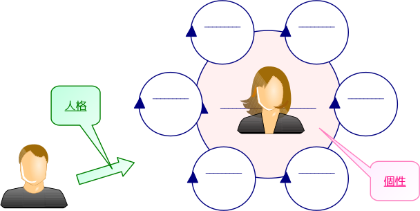
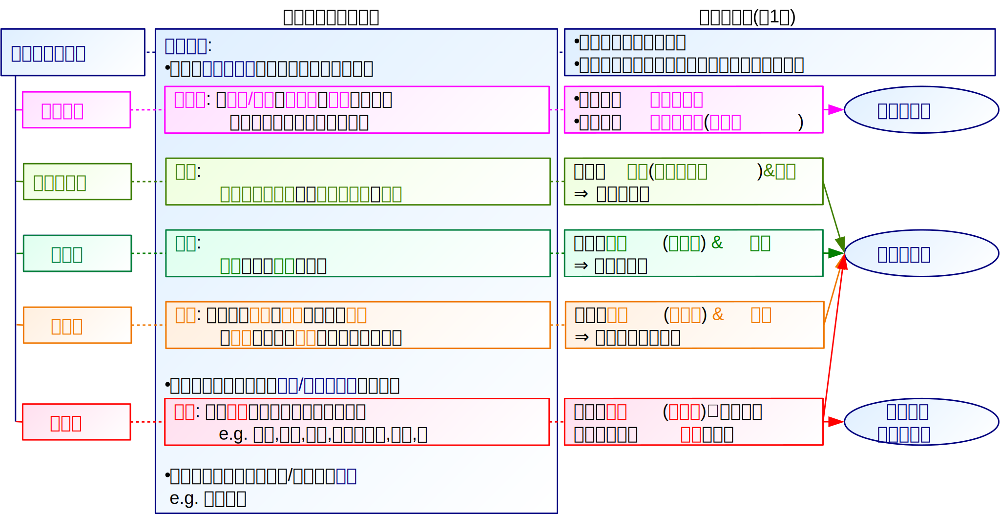
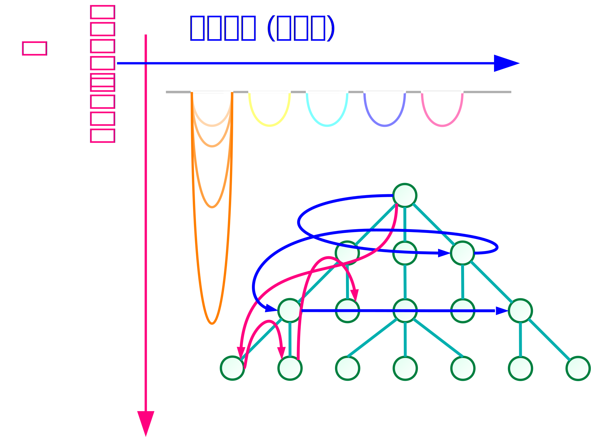

# 創発

本章では、前章で述べたシステムの創発性に注目し、社会で新たな情報が生まれる過程を述べる。

まず、新たな情報を生みだす方法として、組み合わせとその関連性を見出す重要性を述べる。
次に、心理システムと社会システムによる創発のそれぞれについて、Luhmannが定義した個性と人格の概念を用いて述べる。
更に、創発を促す発想法や思考法について、より具体的に述べる。
続けて、代表的な創発過程である問題解決と、問題解決で用いられるモデルについて述べ、最後に創発と還元主義の関係を述べる。

## アイデア

システムの創発性に基づいて、 *あるシステムで新たな情報が生まれる現象* を、そのシステムにおける **創発** (**emergence**)と呼ぶ。
また、 *創発の結果として生じた新たな情報* を **アイデア** (**idea**)という。

Youngはアイデアを、 **既存の要素の新たな組み合わせ** だと述べている\[[young]\]\[[young-j]\]。
あらゆる発想は全く何もないところから湧き出すのではなく、意識的であれ無意識的であれ、既知のものを組み合わせて生まれる。

そうした発想を生み出すには、組み合わせる元になる「既存の要素」について、現状でどのようなものが存在し、何が実現されていないのかといった、相応の知識が必要となる。
特に、複数の「既存の要素」を組み合わせることから、複数の分野についての専門的な知識が必要である。

更に、既知の要素から意味のある組み合わせを生み出すには、 *物事の関連性(構造)を見つけ出す* ことが必要である\[[young]\]\[[young-j]\]。
物事の表層の類似性に囚われず、その深層にある繋がりを洗い出すことで、強引なこじつけではなく、新鮮で自然な関連性を見出せる。
そうして見出された関連性こそが新たな情報であり、新たなアイデアである。

アイデアは、それまで存在しなかった、人間にとって意味のある新たな情報であり、創発により社会が発展するといえる。
Schumpeterは、このように新たな組み合わせを生じさせることを **イノベーション** (**innovation**)と呼び、社会発展の源泉だとした\[[schumpeter]\]。

> #### info::創造システム
>
> 井庭は、個人や組織における創発の過程を表す枠組みとして、 **創造システム** の理論を提唱している\[[iba]\]\[[iba-j]\]。
井庭によれば、創造は *発見* (*discovery*)を要素とするシステムである。
発見は *アイデア* 、 *関連づけ* (*association*)、 *帰結* (*consequence*)の3つの選択からなる過程であり、発見が継続して生成されることで創造がなされるという。
ここでいうアイデアは、創造を行うシステムにとっての新たな情報であり、世間的に新しいものであるかは問われない。
このアイデアをどう他の情報と関連付けるか、つまりどう相互の関連性を見出すかが重要であることは、上述のYoungの主張と同様である。

## 心理システムによる創発

システムが要素間の新たな関連性を見出すには、そのシステムがそれらの要素に参画しており、それぞれの要素に精通していることが必要である。
ある *システムが所属する他のシステムの部分を除いた、そのシステムに固有の部分* を、そのシステムの **個性** (**personality**)と呼ぶ\[[borch]\]。

例えば、あるシステムが他のシステムと図の関係にあるとする。
このとき、図中で他のシステムに属する部分を除いた、桃色の部分が個性である。

個人による、つまり1つの *心理システムによる創発* では、心理システムの個性が特徴的であることが必要である。
ここでいう特徴的とは、所属する *他のシステムの組み合わせが他にない珍しいもの* である、ということを指す。
この組み合わせがよくあるものである場合には、心理システムが思考を重ねても、誰でも思い浮かぶ発想しか現れない。
一方、特徴的な個性をもつ場合には、心理システムの思考は他にないものになり、新たなアイデアが生じる可能性が高い。

## 社会システムによる創発

個人には限定合理性があるため、1つの心理システムによる創発にも限界がある。
そのため実際には、複数人が協働し、 *社会システムによる創発* を行うことが多い。
社会システムによる創発では、複数の心理システムの個性を掛けあわせて、コミュニケーションを通じて個人の限定合理性を克服することが期待される。

社会システムによる創発においても、新たなアイデアを生み出すには、 *社会システムの個性が特徴的* であることが必要である。
社会システムの個性が特徴的であるためにはまず、心理システムの場合と同様に、社会システムが所属する他の心理システムの組み合わせが珍しいものである必要がある。
例えば、チームの人選を行う際には、似たような個性を持つメンバーではなく、できるだけ個性の異なるメンバーを集める必要がある。

社会システムはコミュニケーションを要素とするため、コミュニケーションなしには社会システムによる創発はなしえない。
コミュニケーションが新たなアイデアを生み出すには、それぞれの心理システムの個性が反映されたコミュニケーションが必要である。
いくら個々のメンバーが特徴的な個性を持っていても、そうした個性を持つことが他のメンバーとのコミュニケーションの俎上に登らなければ、社会システムによる創発には貢献しない。
このように、 *ある心理システムを他の心理システムがコミュニケーションでどう扱うか* を、そのシステムの **人格** (**character**)という\[[borch]\]。
従って社会システムによる創発では、個々のメンバーがどのような個性を持つ人間であるかをチーム内で共有させることが必要である。
個々のメンバーの *個性を人格として顕在化し、メンバーの個性をチームの個性として取り込む* ことで、それを組み合わせた新たなアイデアが生じる。

> #### info::知的財産
>
> 知的財産法は、創発の促進を目的に存在する法的な枠組みの総称であり、その概略を図に示す。
現代における知的財産法の枠組みでは、基本法としての知的財産基本法\[[law-ip]\]があり、その下に特許法\[[law-patent]\]、実用新案法、意匠法、商標法、著作権法\[[law-copyright]\]などの個別法が置かれている。
>
> 知的財産基本法では、その目的を「新たな知的財産の創造及びその効果的な活用による付加価値の創出」としている。
また特許法は「発明の保護及び利用を図ることにより、発明を奨励し、もつて *産業の発達* に寄与すること」、著作権法は「著作者の権利及びこれに隣接する権利を定め、これらの文化的所産の *公正な利用* に留意しつつ、 *著作者等の権利の保護* を図り、もつて *文化の発展* に寄与すること」を目的としている。
ここから、知的財産法はいずれも、それぞれの分野における創発の促進を目的としていることが分かる。
>
> 知的財産基本法では、 **知的財産** (**知財**)を *人間の創造的活動により生み出されるもの* と定義している。
知的財産を生み出した者には **知的財産権** を付与する一方で、知的財産を効果的に活用する方法を定めている。
特許法は「自然法則を利用した技術的 *思想* の創作のうち高度のもの」を *発明* (アイデア)と定義し、発明者に **特許** (**patent**)を与えて保護する。
また著作権法は「 *思想又は感情* を創作的に *表現* したものであつて、文芸、学術、美術又は音楽の範囲に属するもの」を **著作物** と定義し、その創作者に **著作権** (**copyright**)を与えて保護する。
>
> また、社会システムによる創発を保護するための枠組みとして、職務発明や職務著作といった制度が存在する。

## 発想法と思考法

システムによる創発の効率を上げるには、上述のような、通常の思考やコミュニケーションとは異なる工夫が必要となる。
そこで、効率的な思考を行うため、さまざまな発想法や思考法が提案されている。

例えばOsbornによる **Brainstorming** は、集団で特定のテーマについてアイデアを出し、それぞれの思考の成果を付箋などに書き出して集積する発想法である。
アイデアの質より量を優先し、突飛なアイデアを歓迎することで、より斬新な創発を行う。

また、de Bonoによる **水平思考** (**lateral thinking**)は、非論理的であってもより多くのアイデアを生み出すための思考法である\[[debono]\]。
目的とする創発を達成するため、伝統や慣習に基づく暗黙の仮定を排除し、あらゆる可能性を考慮することで、斬新なアイデアを生み出す。
水平思考は、根拠や理由を示したり、正しい仮定に基づいて論理を展開する **垂直思考** (**vertical thinking**)と対比される。

これらはいずれも創発を促す方法であるため、可能な限り多くのアイデアを生み出し、その中で有益なものを見出すことを目的としている。
これらの方法に共通するのは、 **アイデアの産出と吟味を同時には行わない** ことである。
つまり、初めにBrainstormingや水平思考により、 *考えうるアイデアをすべて出す* 、 **思考を広げる** ( **発散** する)段階を置く。
次に、KJ法や垂直思考により、 *出たアイデアの良し悪しをまとめて吟味* する、 **思考を深める** ( **収束** する)段階を置く。

このように2つの段階に分ける理由として、次のものが挙げられる。

- アイデアの産出と吟味を交互に行うと、思考やコミュニケーションが同じ範囲を何度も行き来するため、 *アイデアの幅が広まらない* 。
- アイデアの産出と吟味を交互に行うと、 *思考の切り替えに時間を要する* ため、創発の効率自体が低くなる。
- アイデアの吟味や検討は批判的な姿勢で行う必要があるため、アイデアの産出と吟味を交互に行うと、 *思考が萎縮* して突飛なアイデアが生まれにくくなる。
これらの方法により、思考を広げる段階と思考を深める段階を明確に区分し、集団の個性を引き出すコミュニケーションを支援することが、斬新で優れたアイデアを生み出すことに繋がるといえる。

## 問題解決

システムによる創発をより実践的に行うのが、問題解決の過程である。
Simon\[[simon2]\]によれば、 **問題** (**problem**)は、 *理想的な状態* (*desired state*)と *現在の状態* (*existing state*)の間に *差* があることである。
従って **問題解決** (**problem solving**)とは、 *現在の状態から理想的な状態に至る道を見つける* ことであり、この道を問題の **解** (**solution**)という。

問題に対する解は一つしか存在しないとは限らず、複数存在することもある。
そのうち一つでも解を発見することができれば問題解決は達成されるが、簡単に見つかる解は実行に非常に長い時間を要したり、膨大な資本が必要となったり、実現が困難であることが多い。
多数ある解のうち、より効果的で実現可能な解を見つけることが重要となる。

一般的な問題解決は、次の手順で行われる。
但し、常にこの順番で進むわけではなく、各段階において、前段階で行う内容が不十分だと分かった場合には、必要に応じて1つ以上前の段階に戻ることがある。

0.  **問題定義** (**problem definition**):
		対象とする問題の *理想的な状態* ( **目標** (**goal**)ともいう)と *現在の状態* を明確かつ簡潔に示す。
0.  **現状の調査** (**investigation**):
		問題が現在どのような状態になっているかを、具体的に *調査* する。
0.  **構造分析** (**analysis**):
		問題における諸要素の関連性( *構造* )を **モデル** (**model**)として明示し、理想的な状態と現在の状態に差がある *原因* を明らかにする。
0.  **解の提案** (**proposal**):
		明らかになった問題の原因を取り除く *アイデア* を *提案* する。
> #### info::探索
>
> ある問題を解を求める最も単純な方法は、考えうるすべての組み合わせを総当たりで試す **全数探索** である。
特に、暗号の解読や認証の通過を目的に行う全数探索は、 **総当たり攻撃** (**brute-force attack**)と呼ばれる。
全数探索は単純で古典的だが、解の範囲がある程度限定される場合には、人手でも行える他、コンピュータを用いて機械的にも行えるため、十分有効な方法である。
>
> 全数探索のうち、一つの場合に注目してより *深く* 探索する **深さ優先** 探索は、注目した部分に解が含まれる場合は高速に解を発見できるが、注目した部分に解が含まれない場合は探索に長時間を要する。
深さ優先探索は特定の場合を深めることから、垂直思考と類似している。
>
> また、複数の場合を順に調べてより *広く* 探索する **幅優先** 探索は、解が比較的浅い部分にある場合は高速に解を発見できるが、解が深い部分にある場合は探索に長時間を要する。
幅優先探索は多数の場合を検討することから、水平思考と類似している。
>
> 実用上は、深さ優先と幅優先を組み合わせた方法や、評価関数に基づいて次に探索すべき部分を決定する方法などが用いられる。
また、すべての場合を検討するのではなく、 *確率的に場合を選択* し、選択した場合のみを検討する **Monte Carlo法** などもよく用いられる。

## モデル

Wilson\[[wilson]\]によれば、 **モデル** (**model**)とは *ある人のある状況に関する明示された解釈* である。
また、 *モデルを作成* することを **モデリング** (**modeling**)という。

定義に「ある人の」とあるように、モデルには状況の解釈を行う *人間が存在* している。
モデルは、その人間の意思に基づいて、現象をある特定の側面から分析したものである\[[kodama]\]。
即ち、モデルは唯一絶対のものではなく、解釈する人間が *現象のどの部分に意味を見いだすか* によって現象の *本質は変化* し、できあがるモデルも変化する。

構造を示すモデルを表現するためには、文章よりも **図** を用いるのが適当である。
一般的には、要素を実体として四角や丸などの図形で表し、要素間の関連を、実体を結ぶ矢印などの線で表現する。
図の標準規格としては *Unified Modeling Language* (*UML*)\[[uml]\]などが知られているが、分野やモデルの種類により、様々な種類の図が用いられる。

## 創発主義と還元主義

システムの創発性を認める **創発主義** と、総和的であるとする **還元主義** のいずれが正しいかは、しばしば論争になる。
還元主義の立場ですべての現象を分析し、個別の要素と全体の現象の間にある因果関係を明瞭に説明することは困難である。
創発性はシステムの性質を便利に説明できるが、予測不可能な性質が急に現れることは超科学的であり、このようなものの存在を認める点で非科学的な考え方を含んでいる。

こうした創発性の「怪しさ」を説明しつつ利点を取り入れるため、創発性という概念を明確に定義することが試みられてきた。
Broadは、要素$A, B, C$からなるシステム$S$に特徴的な性質が、要素$A, B, C$が単独で示す性質や、それらが$S$と異なる集合に含まれるときの性質から *理論的に演繹できない* 性質を創発性と定義\[[broad]\]した。
ここで「理論的に」というのは、システムが本来もつ性質として創発性があるのではなく、あくまで *その時点の科学理論では説明できない* ことを意味している。
つまり、 *システムのあらゆる現象は本来、総和的に説明できる* という前提に立ちつつ、現時点で人間が持つ理論では説明できないことを創発性と呼んでいる\[[maraterre]\]。

!INCLUDE "bib.md"
