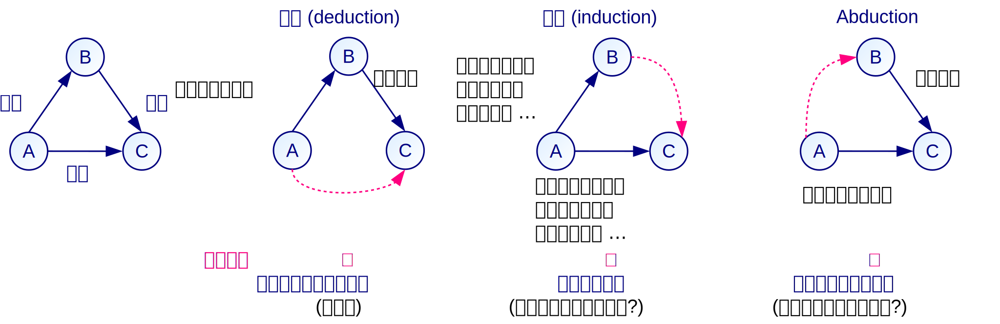

# 論理

本章では、他者への介入において不可欠な論理について述べる。
まず論理が必要とされる理由を述べ、論理において重要な定義、命題や定理、証明について述べる。

## 論理の目的

行った説明や主張に対して他者の同意を得るには、自分と相手で共有できる価値観、すなわち成果メディアが不可欠である。
愛や芸術、宗教、権力などで納得を得られる相手でなければ、相手と共有できる *真理* に基づき、自分の主張の「正しさ」を示すことで相手を説得する必要がある。
この、真理に基づいてある主張の「正しさ」を説明する過程を **論理** (**logic**)と呼ぶ。

物事の「正しさ」を検証するのが人間である以上、ある **物事が絶対に正しいことを検証する手段は存在しない** 。
実験で正しさを裏付けると思われる結果が得られても、事前の準備や事後の分析で誤りが生じている可能性は否定できない。
数学の定理でも、その定理を導く論理に誤りがあるかは人間が検証する以上、検証する人間が誤りを見過ごすことは当然にありえる。
実験や証明を機械化し、プログラムに正しさの判断を委ねても、プログラム自体やハードウェアに欠陥がある場合もありうる。
あくまで、多数の人間や機械の検証を経ることで、その物事が誤りである可能性を小さくしているだけである。
従って、「正しい」とされる物事も、それは *まだ有力な反論が存在しない* ことを示しているに過ぎない。

物事の「正しさ」の検証にあっては、論理であれば他者の立場でも納得できる **客観性** が求められる。
実験や調査であれば、他者が同じ実験や調査を再度行っても、同じ結果が得られる **再現性** が必要である。
客観性や再現性のない記述は、たとえそれが本当は正しい *真理であったとしても、検証できないために正しいとはみなされない* 。

## 定義

論理的な説明を行うには、説明で用いる用語に **定義** (**definition**)を与え、他者との間で用語の意味に齟齬が生じないようにする必要がある。
定義は、ある *記述$B$に対して用語$A$を与え* 、以降の説明において$A$を$B$の意味で用いることを示すものである。
例えば、本稿では「情報」「システム」「創発」などの用語を別の表現で言い換えることで、これらの用語を定義している。

従って、最も基本的な定義の表現は「$A$を$B$と定義する」「$B$を$A$と呼ぶ」などである。
数式ではこれを「$A = B$」と記すが、左辺が定義される用語であることを明示するために「$A := B$」と記すこともある。

 **定義を行う際は、定義する用語$A$の特徴を明確に示し、$A$ではないものとの区別を示す** 必要がある。
「$A$は$B$ *ではない* 」という否定の記述や、「$A$は$B$の *ための* ものである」と目的のみを示す記述、「$A$は$B$ *の1つ* である」「$B$ *など* を$A$という」といった例示のみの記述は、$A$と$A$以外のものを区別できない。
従ってこれらの記述は、用語$A$が何を指しており、何ではないのかが明瞭でないため、適切な定義とはいえない。

定義は、 **説明に用いる用語の意味を共有して誤解を防ぐ** 目的の他、 **説明で頻繁に用いる用語を短く言い換え、説明を円滑にする** 目的でも用いられる。
これらの目的を踏まえると、定義する用語の数は必要最小限に留めるべきであり、 *説明に用いない用語を定義することは適切でない* 。

## 命題と定理

 *「正しい」かどうか明確に判断できる文* を **命題** (**proposition**)という。
命題$P$が成立するとき「$P$は **真** (**true**)である」といい、成立しないとき「$P$は **偽** (**false**)である」という。
 *真である命題* を一般に **定理** (**theorem**)というが、一般的には、真である命題のうち *特に重要なもの* を指して「定理」と呼ぶことが多い。

「$P$は$Q$である」という形の命題を、「ならば」の意味の記号「$⇒$」を用いて「$P ⇒ Q$」と表す。
$P, Q$が集合のとき、「$P$は$Q$である」という命題は「$x$が$P$の要素ならば、$x$は$Q$の要素である」という形に変形できる。
例えば、「ネコは動物である」という命題は、「$x \in \text{ネコ} ⇒ x \in \text{動物}$」と表せる。

> #### info::「ならば」の形式的定義と対偶
>
> $P, Q$が命題のとき、命題「$P ⇒ Q$」の厳密な定義は「命題$P$が真であれば命題$Q$が真である」である。
従って「$P ⇒ Q$」が真となるのは、「$P$かつ$Q$」が成り立つときか、「 *$P$ではない* ($P$が偽である)」ときである。
「かつ」を表す記号「$\wedge$」、「または」を表す記号「$\vee$」を用いて定義記号「$:=$」で記せば、「$(P ⇒ Q) := (\bar{P} \vee (P \wedge Q)) = ((\bar{P} \vee P) \wedge (\bar{P} \vee Q)) = (\bar{P} \vee Q)$」となる。
>
> この定義に従えば、「命題「$P ⇒ Q$」とその対偶「$\bar{Q} ⇒ \bar{P}$」の真偽は等しい」という定理は、次のように示せる。
\[ (\bar{Q} ⇒ \bar{P}) = (\bar{\bar{Q}} \vee \bar{P}) = (Q \vee \bar{P}) = (\bar{P} \vee Q) = (P ⇒ Q) \]

## 推論

命題が真であることを示す過程を、 **推論** (**inference**)や **証明** (**proof**)などと呼ぶ。
代表的な推論法には、次に示す演繹・帰納・アブダクションがある。
演繹とアブダクションはそれぞれ、de Bonoの垂直思考と水平思考に対応する。
また、演繹は一般的な事実から個別の事実を導くのに対し、帰納は個別の事例から一般的な事実を導く。
以下では、 *前提* 、 *規則* 、 *結論* という3つの命題が存在し、前提に規則を用いると結論が得られるとする。

図に、これら3種の推論方法を比較した図を示す。
図中の矢印は命題を表し、「$A ⇒ B$」は前提、「$B ⇒ C$」は規則、「$A ⇒ C$」は結論である。
また、それぞれの推論法で与えられている命題を実線で、推論により示される命題を点線で示す。

### 演繹

 **演繹** (**deduction**)では、「ソクラテスは人である」という前提と、「人は死ぬ」という規則が与えられたときに、「ソクラテスは死ぬ」という *結論が真だと推論* する。
「$A ⇒ B, B ⇒ C$」のとき「$A ⇒ C$」が成り立つという *三段論法* は、演繹による代表的な推論法である。

演繹による推論では、前提と規則の命題が真なら、 **推論した結論が真であることが保証** され、 *高い厳密性* をもつ。
厳密性を重視する数学や論理学では、演繹以外の推論の使用は認められない。
一方、演繹では **前提に含意される以上の結論を導くことはできない** ため、 *拡張性がない* 。

### 帰納

 **帰納** (**induction**)では、「ソクラテスは人である」「プラトンは人である」「ゼノンは人である」という前提と、「ソクラテスは死ぬ」「プラトンは死ぬ」「ゼノンは死ぬ」という結論が与えられたときに、「人は死ぬ」という *規則が真だと推論* する。

帰納による推論では、前提と結論が真でも、 **推論した規則が真であることは保証されない** ため、 *厳密性は十分でない* 。
この例の場合、例えば「エピクロス」という「死なない人」の例( *反例* )がいる可能性は否定できない。
一方、帰納では前提に含まれる個々の事例を *一般化* でき、前提の内容以上の規則を得る可能性があるため、 *一定の拡張性* をもつ。

物理学や生物学、心理学や社会学では、演繹では正しさを示せない場合が多いため、 *実験* や *調査* 、 *統計* 、 *シミュレーション* などを基に帰納的に推論するのが一般的である。
数学や工学では、帰納による推論をそのまま使うことは認められないが、帰納に類似した数学的帰納法を用いることがある。
また、人力や機械で *起こりうる場合をすべて列挙* し、すべての場合について真であることを証明することがある。
例えばグラフ理論で、隣接する領域が異なる色になるよう塗り分けるのに必要な色数を示す「四色定理」の証明は難問とされていたが、コンピュータを用いてすべての場合について命題が正しいことが示された\[[appel-haken1]\]\[[appel-haken2]\]。
これらの数学的帰納法や全数列挙はあくまで演繹による推論であり、帰納ではない。

### アブダクション

 **アブダクション** (**abduction**)では、「ソクラテスは死ぬ」という結論と「人は死ぬ」という規則が与えられたときに、「ソクラテスは人である」という *前提が真だと推論* する。
アブダクションによる推論では、結論と規則が真でも、 **推論した前提が真であることは保証されない** 。
この例の場合、死んだ「ソクラテス」は人ではなく、ネコやイヌなどの人以外の動物である可能性もある。

アブダクションによる推論は *高い拡張性* をもつ一方、帰納よりも *厳密性に乏しく* 、このままでは命題の正しさを示すのは難しい。
そこで、アブダクションで得られた命題を *仮説* として、演繹により仮説の正しさを示し、帰納により実例で仮説の正しさを裏付けることがよく行われる。

> #### info::証明の形式的定義
>
> 命題の列$P_1, \cdots, P_n$について、任意の$i (1 \leq i \leq n)$について「$P_i$は公理である」または「$P_1, \cdots, P_{i-1} ⇒ P_i$が真である」を満たすとき、$P_1, \cdots, P_n$を$P_n$の **証明** (**proof**)と呼び、$P_n$を **定理** (**theorem**)と呼ぶ。
>
> 例えば、命題「2つの偶数の和は偶数」の証明をこの定義に従って行うと、次のようになる。
- $P_1$: 「2つの偶数$x, y$は2つの整数$p, q$を用いて$x = 2p, y = 2q$と表せる」
- $P_2$: 「$x + y = 2p + 2q$」
- $P_3$: 「$2p + 2q = 2(p + q)$」
- $P_4$: 「$2(p + q)$は偶数」
- $P_5$: 「2つの偶数の和は偶数」

>
> このとき、命題の列$P_1, \cdots, P_5$について、$P_1$は偶数の定義により真、$P_2$は$P_1$により真、$P_3$は加法・乗法の定義と分配法則により真、$P_4$は偶数の定義により真、$P_5$は$P_1, \cdots, P_4$により真となり、元の命題は真である。

## 科学における推論

実際に命題$P$の正しさを示す場面では、演繹に比べて厳密性の低い、次の方法も用いられる。

- $P$を述べた *文献* を引いて示す
		過去の論文、書籍、記事などで、$P$を述べた部分を根拠として示す。
		重要な根拠の場合には、$P$を述べた部分を *出典* として *引用* することもある。
		出典自体の正しさに疑義がある場合、$P$の正しさを保証できない。
- $P$が真だと *仮定* する
		理論を構築するにあたって必要な命題については、 **公理** (**axiom**)や公準・原理・前提などと呼び、真だと仮定することがある。
		これはあくまで「仮定」なので、その命題の正しさを示すわけではないが、正しさが十分に明らかだと考えられる場合には、この仮定を行うことができる。
		数学や論理学など何らかの命題を仮定しないと理論を構築できない場合や、物理学や生物学で実際の観測が不可能な場合に、はじめに仮定をおいて理論を構築する。
- $P$を別の命題$P'$に *変形* ( *帰着* )して示す
		より単純な別の命題に変形して解くことで、そのままでは複雑で扱いにくい命題$P$を示す。
		文章で表された問題を数式に変形して解いたり、欲しい情報をキーワードに変形して検索エンジンに委ねたりした上で、得られた結果を解釈して元の問題の解とする。
		変形した問題$P'$は、既に解が知られている問題であるか、時間的・経済的・人員的に解決可能な問題である必要がある。
- $P$を複数の命題$P_1, P_2$に *問題分割* して示す
		命題$P$を複数の命題の組み合わせに分割することで、問題を明確化し示しやすくする。
		$P$を「$P_1$かつ$P_2$」の形に分割する場合と、「$P_1$または$P_2$」の形に分割する場合がありうる。
		前者には、手順のように順序で分割できるものや、複数の命題を元に$P$を示すものなどがある。
		後者には、場合分けのようにいずれかの場合が満たされればよいものなどがある。
証明された命題の体系を **理論** (**theory**)や学問と呼び、その全体は **科学** (**science**)と呼ばれる。

!INCLUDE "bib.md"
