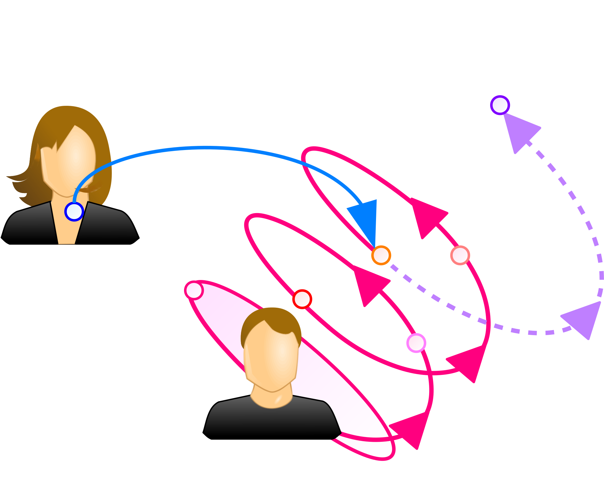

## 介入
本章では、コミュニケーションのうちでも特に、他のシステムの変化を求めて行うものについて述べる。

まず、Luhmannのいう介入の概念と、具体的な介入の例としてプレゼンテーションを紹介する。
次に、介入を促す具体的な方法を述べ、目標を提示する重要性を示す。

### プレゼンテーション
Luhmannは、 *あるシステムがその行為を通して、他のシステムがどのように行為するか規定* する行為を **介入** (interference)と呼んだ\[[luhmann-interfere]\]。
端的にいえば、介入とは、他者や組織など *他のシステムを変化させるために行うコミュニケーション* のことである。

Luhmannは介入の例として *教育* を挙げたが、一般に **プレゼンテーション** と呼ばれる行為はいずれも、聴衆である心理システムの思考に介入して言動の変容を促す行為である。
従って、これらはここでいう介入に当たる。

図に、介入の概念図を示す。
図では、ある個人(心理システム)の現在の状態に対して他者(別のシステム)が介入している。
この介入により、本来のシステムのオートポイエーシスによって達する状態とは異なる状態に至らせる様子を、点線の矢印で示している。

### 目標と介入
介入は他のシステムの変化を求める行為であるため、介入が必要な場面は、対象とするシステムに問題がある状態である。
従って介入にあたっては、対象とするシステムについて、現在の状態から変容後の理想的な状態(目標)に至る解を見つける問題解決を行うことが基本となる。

だが、システムは内部で変化するというオートポイエーシス性を考慮すれば、外部から行う問題解決だけでは、介入を達成できない。
即ち、対象のシステムに行動することを要求したり、特定の思考様式を強制したりするといった、 *外部からの一方的な働きかけで対象のシステムを変化させることは不可能* である。

従って適切な介入を行うには、対象のシステムに対して、現状から目標へのオートポイエーシスを促す必要がある。
以下では、対象とするシステムを心理システムである特定の相手として、具体的な介入の方法を述べる。

0. 介入にあたり、まずは相手に *目標を示し、その状態が理想的なことを相手が納得* する必要がある。
	相手の納得を得るためには、相手が何を欲しているか、何を求めているかという欲求を的確に捉えることが重要である。
0. 相手が目標に共感した後には、その *目標に至る解を相手に示す* ことが必要である。
	いくら相手の共感を得ても、望む状態に至る方法が分からなければ、目標に至らせることはできず、相手の不満を募らせるだけである。
	そこで、問題の解となる方法を可能な限り明確な形で示し、示した方法に従えば目標に辿り着けるようにする。
0. 相手が目標に至ることができる方法を提示した後には、 *相手がその方法を実践可能な環境を整える* ことが必要である。
	例えば教育の場合であれば、適切な実習時間を確保するなどして、時間的、経済的、肉体的、精神的に実践可能な環境を用意する必要がある。
	また、相手が方法を実践している際に困難に遭遇した場合や、疑問が浮かんだ場合に、教師や支援員のような、相手の変容を支援する体制があることも重要である。

> #### info::Instructional Design
>
>  *Instructional Design (ID)* は、教育を介入であると捉えて、授業やカリキュラムの設計を行う理論である\[[kougo]\]。
ここでいうinstructionは、いわゆる「教える」行為全般を指し、学び手に対する意図的な介入のことである。
>
> IDでは、学習者にとっての望ましい状態と現状の間に差があること、つまり学習者にとっての問題を *パフォーマンス・ギャップ* と呼ぶ。
instructorは、この学習者が抱える問題への解として、一連の教育課程である *コース* を提案する。
このコースは複数のinstructionが相互に関連しあい成立するため、単なるinstructionの集合ではなく構造をもつシステムである。
>
> 提案するコースにはまず、望ましい状態に向かう一貫性が必要である。
更に、相互のinstructionに関連があり、 **コースに一貫性があることを学習者が認識** できなければならない。
学習者がコースの構造を認識できなければ、学習者はなぜinstructionに従うべきか理解できず、コースを学ぶ動機を失ってしまう。
>
> 問題の解には様々な方法があるため、解が「正しい」かどうかは一概に判断できない。
だが、学習者にとってその解がどれほど効果的かは、学習者が実際に問題を解決できたかを見れば明確に測定可能である。
instructorには、多数考えられる解のうちで、最も **学習者にとって効果的** なものを提案することが求められる。

!INCLUDE "bib.md"
