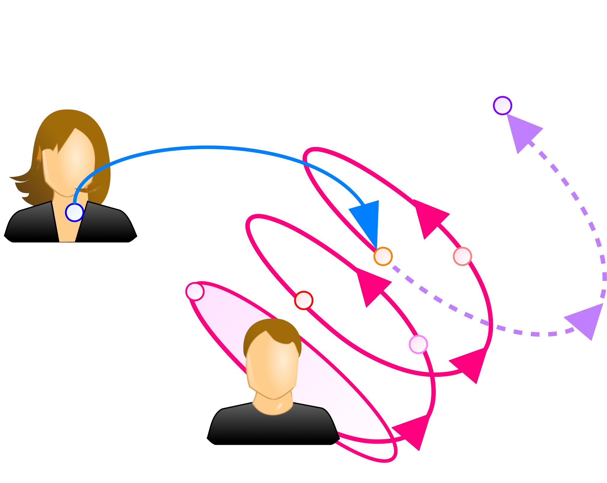

## 介入
本章では、コミュニケーションのうちでも特に、他のシステムの変化を求めて行うものについて述べる。

まず、Luhmannのいう介入の概念と、介入の例、介入の分類としての明示的な介入と暗示的な介入を示す。
次に、介入における意図の役割と、予期を与える重要性を述べる。
更に、明示的な介入と暗示的な介入のそれぞれを詳述する。

### 介入の定義
Luhmannは、 *あるシステムがその行為を通して、他のシステムがどのように行為するか規定* する行為を **介入** (**interference**)と呼んだ\[[luhmann-interfere]\]。
端的にいえば、介入とは、他者や組織など *他のシステムを変化させるために行うコミュニケーション* である。
本章では、介入の対象となる他者や組織などのシステムを **対象者** (**target**)と呼ぶ。

 *勧誘* 、 *印象操作* 、 *プレゼンテーション* 、 *説得* 、 *檄文* 、 *指示* 、 *命令* などはいずれも、聴衆である心理システムの思考に **明示的** (**explicit**)に介入し、その言動の変容を促す行為である。
また、施設などにおける *誘導* 、モノのデザインにおける *afford* や、Luhmannが介入の例に挙げた *教育* は、対象者に明示せずとも、特定の行為や学習を **暗示的** (**implicit**)に促す点で同様であり、これらもここでいう介入に当たる。

図に、介入の概念図を示す。
図では、ある個人(心理システム)の現在の状態に対して他者(別のシステム)が介入している。
この介入により、本来のシステムのオートポイエーシスによって達する状態とは異なる状態に至らせる様子を、点線の矢印で示している。

### 意図と予期
介入は明確な目的を持って行われるコミュニケーションであり、この *コミュニケーションを行う目的* を **意図** (**intent**)と呼ぶ。
介入における「適切な」表現とは「意図が明確に伝わる表現」であるため、意図が明確でない状態では、「どのような表現が適切であるか」を判断できない。
このような状態では、表現の選択において良い表現を選択できず、介入は成功しない。

また、明示的か暗示的かを問わず、介入は対象者なしには成り立たない。
対象者が意識するとしないとに関わらず、意図を **予期** させることができなければ、介入は唐突さや強引さを感じさせるため、成功しにくい。
介入にあたっては、必要であれば段階を設けて対象者に展開を予期させ、違和感なく意図に従えるようにすることが重要である。

### 明示的な介入
介入は対象者の変容を求める行為であるため、介入が必要な場面では、対象者に何らかの問題があると考えられる。
従って介入にあたっては、対象者について、現在の状態から変容後の理想的な状態(目標)に至る解を見つける問題解決を行うことが基本となる。

だが、システムは内部で変化するというオートポイエーシス性を考慮すれば、外部から行う問題解決だけでは、介入を達成できない。
即ち、対象者に行動することを要求したり、特定の思考様式を強制したりするといった、 *外部からの一方的な働きかけで対象者を変容させることは不可能* である。

従って適切な介入を行うには、対象者に対して、現状から目標へのオートポイエーシスを促す必要がある。
以下では、具体的な介入の方法例を述べる。

0. 介入にあたり、まずは対象者に *目標を示し、その状態が理想的なことを対象者が納得* する必要がある。
	対象者の納得を得るためには、対象者が何を欲しているか、何を求めているかという欲求を的確に捉えることが重要である。
0. 対象者が目標に共感した後には、その *目標に至る解を対象者に示す* ことが必要である。
	いくら対象者の共感を得ても、望む状態に至る方法が分からなければ、目標に至らせることはできず、対象者の不満を募らせるだけである。
	そこで、問題の解となる方法を可能な限り明確な形で示し、示した方法に従えば目標に辿り着けるようにする。
0. 対象者が目標に至ることができる方法を提示した後には、 *対象者がその方法を実践可能な環境を整える* ことが必要である。
	例えば教育の場合であれば、適切な実習時間を確保するなどして、時間的、経済的、肉体的、精神的に実践可能な環境を用意する必要がある。
	また、対象者が方法を実践している際に困難に遭遇した場合や、疑問が浮かんだ場合に、教師や支援員のような、対象者の変容を支援する体制があることも重要である。

> #### info::Instructional Design
>
>  *Instructional Design* (*ID*)は、教育を介入であると捉えて、授業やカリキュラムの設計を行う理論である\[[kougo]\]。
ここでいうinstructionは、いわゆる「教える」行為全般を指し、学び手(対象者)に対する介入を指す。
>
> IDでは、対象者にとっての望ましい状態と現状の間に差があること、つまり対象者にとっての問題を *パフォーマンス・ギャップ* と呼ぶ。
instructorは、この対象者が抱える問題への解として、一連の教育課程である *コース* を提案する。
このコースは複数のinstructionが相互に関連しあい成立するため、単なるinstructionの集合ではなく構造をもつシステムである。
>
> 提案するコースにはまず、望ましい状態に向かう一貫性が必要である。
更に、相互のinstructionに関連があり、 **コースに一貫性があることを対象者が認識** できなければならない。
対象者がコースの構造を認識できなければ、対象者はなぜinstructionに従うべきか理解できず、コースを学ぶ動機を失ってしまう。
>
> 問題の解には様々な方法があるため、解が「正しい」かどうかは一概に判断できない。
だが、対象者にとってその解がどれほど効果的かは、対象者が実際に問題を解決できたかを見れば明確に測定可能である。
instructorには、多数考えられる解のうちで、最も **対象者にとって効果的** なものを提案することが求められる。

### 暗示的な介入
対象者に特定の行為を促すことを明示しない暗示的な介入では、対象者が特に意識せずとも、 *自然と* 求める行為を行うようにする必要がある。
特に、特定のモノを対象者が使う場合のように、対象者が目の前にいないモノのデザインの場合には、明示的な介入が行えないため、暗示的な介入が重要である。
また、明示的な介入の場合であっても、暗示的な介入を併用することで、求める行為をより強く促すことが可能になる。

GibsonやNormanは、ある *モノとその対象者の間の関係* を **アフォーダンス** (**affordance**)と呼び、アフォーダンスを伝えるデザインの重要性を示した\[[gibson]\]\[[norman]\]\[[norman-j]\]。
例えば、部屋に入る「扉」がある場合には、対象者はその「扉」を「開く」ことで、部屋に出入りすることが可能となる。
このとき、「扉」と「対象者」の間には「開くことができる」という関係、つまりアフォーダンスがあるといい、「扉」は「開くこと」を **afford** するという。

この「扉」を対象者が適切に使うためには、扉に「ノブ」や「取っ手」を設置し、「この扉を開けることができる」ことを対象者に示す必要がある。
このように *対象者にアフォーダンスを伝え、そのモノの使い方を示すモノ* を、Normanは **シグニファイア** (**signifier**)と呼んでいる\[[norman]\]\[[norman-j]\]。
また、実際に「扉」に設けられた「ノブ」や「取っ手」を、「扉」を使うための **インタフェース** (**interface**)または **ユーザインタフェース** (**UI**)(**user interface**)という。

シグニファイアは対象者にアフォーダンスを想起させるものであるため、ピクトグラムなどと同様に、社会情報の一種である。
社会情報でいうところの「記号」にシグニファイアが、「意味」にアフォーダンスが対応する。
なおSaussureのいうシニフィアン(signifiant)は、フランス語におけるsignifierの現在分詞形であり、シグニファイアと同じものである。

!INCLUDE "bib.md"
